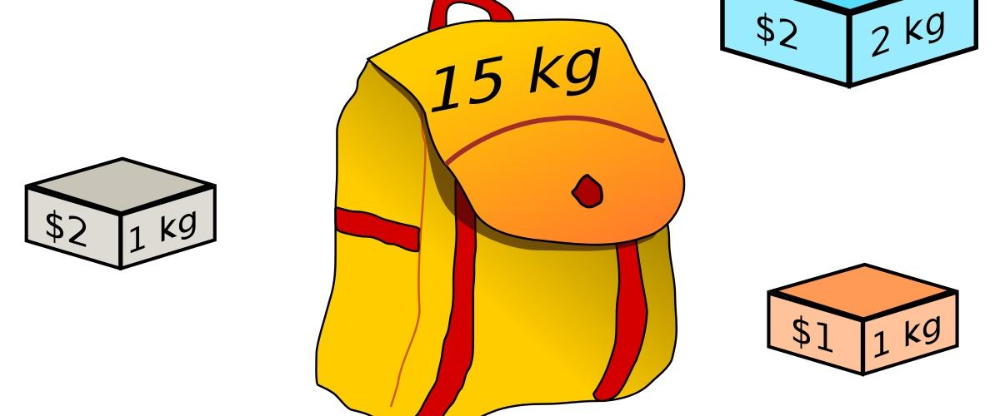
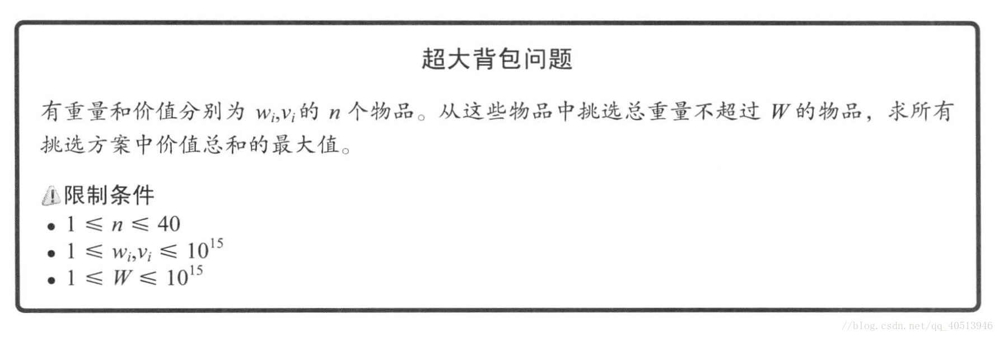

# 01背包



## 一、问题引出
现在一共有 $N$ 件物品，第i（i从1开始）件物品的重量为 $v[i]$ ，价值为 $w[i]$ 。每个物品至多挑选一次，且在挑选出来的物品的总重量不超过 $V$ 的情况下，能装入背包的物品的总价值和最大为多少

---

## 二、分析

### 2.1 暴力思考
对于每一个物品我们无非就两种选择， **选** 和 **不选** 那么对于N件物品的抉择方案数就是 $2^N$ 种，当 $N < 27$ 左右的时候，貌似还可行，我们可以通过 **暴力搜索** 来找出最大的总价值，那么当 $N$ 比较大的时候呢，这种暴力做法就不可取

#### 2.1.1 暴搜代码
```cpp
#include<bits/stdc++.h>
using namespace std;
const int N = 1e3+10;

int n,V,v[N],w[N];
int ans = 0;
/*
loc 表示当前抉择的位置，sum_v表示当前
挑选物品的总容量res_w表示当前挑选物品总价值
*/
void dfs(int loc,int sum_v,int res_w) {
	if(sum_v > V || vis[loc]) return; 
	if(loc == n + 1){
		ans = max(ans,res_w);
		return;
	}
	dfs(loc+1,sum_v + v[loc],res_w + w[loc]);//选取第loc个位置的数
	dfs(loc+1,sum_v,res_w);//不选去第loc个位置的数
}

int main()
{
	scanf("%d%d",&n,&V);
	ans = 0;
	for(int i = 1;i <= n; ++i)	scanf("%d%d",&v[i],&w[i]);
	dfs(1,0,0);
	printf("%d\n",ans);
	return 0;
}

```

### 2.2 子问题分析
对于01背包的子问题是什么呢，我们定义 $f[i][j]$ 表示从前 $i$ 件物品中每件物品最多选一次且总重量不超过 $j$ 的最大价值和，那么我们就能得到 $f[N][V]$ 就是我们要求的问题，即：**从前N个物品中，每个物品至多挑选一次，且在挑选出来的物品的总重量不超过** $V$ **的最大价值和** 

我们来看这个问题的特点：每件物品要么选择，要么不选

我们发现对于 $f[i][j]$ 这个子问题，是从前 $i-1$ 件物品转移过来的，因为第 $i$ 件物品要么选择要么不选，那么对应的前置状态就是 $f[i-1][j-v[i]] + w[i]$ 和 $f[i-1][j]$ 为什么是这两个呢？
- 如果选择第i件物品（前提是装得下），那么留给前 $i-1$ 个物品选择的空间大小 **至多** 为 $j-v[i]$ 的容量 

- 如果不选择第i件物品，那么留给前 $i-1$ 件物品选择的空间的大小 **至多** 为 $j$

那么对于 $f[i][j]$ 来说就只需要在这两种方案中抉择就好了

那么我们就得到了01背包的状态转移方程：

$$f[i][j]=max(f[i-1][j],f[i-1][j-v[i]] + w[i])$$

这个状态转移方程非常重要，因为你学到后面会发现基本上所有的背包问题，例如：完全背包、多重背包、混合背包等等一些列背包都是通过01背包衍生出来的

#### 参考代码
```cpp
const int N = 1e3+10;
int n,V,v[N],w[N];
int f[N][N];

void dp(){
	for(int i = 1;i <= n; ++i)
		for(int j = v[i];j <= V; ++j)
			f[i][j] = max(f[i-1][j],f[i-1][j-v[i]] + w[i]);
    printf("%d\n",f[n][V]);
}
```

### 2.3 复杂度分析

#### 2.3.1 时间复杂度

我们会发现时间复杂度是 $O(NV)$ 的，并不能对上式做一些优化，但是空间复杂度却可以

#### 2.3.2 空间复杂度

分析上式的空间复杂度为： $O(NV)$ ，但是其实空间复杂度还可以优化到 $O(V)$ 
##### 2.3.2.1 01滚动优化

我们继续来分析上面的转移方程，我们只用到了两层状态，第 $i-1$ 层和第 $i$ 层的，那么我们只需要每次存储这两层的状态就好啦，这也叫做 **滚动数组** 的 **01滚动优化**

##### 2.3.2.2 就地滚动优化

但是上面的 **01滚动** 并不能满足我们，因为每一次需要对当前的第i层状态进行一个备份，会增大我们的常数，这个时候我们就有一种更好的滚动优化 -> **就地滚动** ，什么意思呢？也就是我们只需要开一个空间大小为 $V$ 的数组即可，但是这里需要注意，此时我们 $V$ 的遍历方式需要 **从后往前** ，我们来思考为什么，因为如果我们仍然从前往后遍历的话，对于每一个旧的状态就会被新的状态覆盖了，那么此时我们用到的状态就不是上一层的状态了而是被这一层覆盖了的状态，换句话说此时的 $f[j]$ 不能从 $i-1$ 层转移过来，这个操作就相当于对于每一件物品可以选择 **无限次** 的效果了，而这正是 **完全背包** 的就地滚动优化

##### 2.3.2.3 滚动优化代码
01滚动：
```cpp
const int N = 1e3+10;
int n,V,v[N],w[N];
int f[2][N];

void dp(){
	for(int i = 1;i <= n; ++i){
		for(int j = v[i];j <= V; ++j)
			f[1][j] = max(f[0][j],f[0][j-v[i]] + w[i]);
		for(int j = 0;j <= V; ++j) f[0][j] = f[1][j];
	}
	printf("%d\n",f[1][V]);
}
```

就地滚动：

```cpp
const int N = 1e3+10;
int n,V,v[N],w[N];
int f[N];

void dp(){
	for(int i = 1;i <= n; ++i)
		for(int j = V;j >= v[i]; --j)
			f[j] = max(f[j],f[j-v[i]] + w[i]);
	printf("%d\n",f[V]);
}
```
### 2.4 记忆化搜索
上面我们分析了一种暴力的做法，在通过分析子问题后，我们可以稍微优化一下，写成这样：

```cpp

//从第i个物品开始挑选总重量小于j的最大价值和
int dfs(int i, int j){
    int res;
    //已经没有剩余物品
    if(i == n + 1) res = 0;
    //无法挑选第i个物品
    else if(j < v[i]) res = dfs(i+1, j);
    //比较挑和不挑的情况，选取最大的情况
    else res = max(dfs(i+1, j), dfs(i+1, j-v[i])+w[i]);
    return res;
}
```

但是这样仍然会超时，我们分析会发现对于某些状态其实我们重复多次访问了，造成了时间复杂度非常高，所以我们通过记忆化搜索，将我们搜到的状态都记录下来，第二次访问的时候直接返回即可：
```cpp
//n,W 如题意所述
int W, n;
int w[N], v[N];
int f[N][N];
//从第i个物品开始挑选总重量小于j的最大价值和
int dfs(int i, int j){
    if(f[i][j] > 0) return f[i][j];
    int res;
    //已经没有剩余物品
    if(i == n + 1) res = 0;
    //无法挑选第i个物品
    else if(j < v[i]) res = dfs(i+1, j);
    //比较挑和不挑的情况，选取最大的情况
    else res = max(dfs(i+1, j), dfs(i+1, j-v[i])+w[i]);
    //将结果记录在dp数组中
    return f[i][j] = res;
}
```
其实关于上面的搜索部分我们可以写的更简单一点：
```cpp
////表示的是从第i个物品到第n个物品选择总重量不超过j的最大价值
//初始化f数组全为0
int dfs(int i, int j){
    if(f[i][j] > 0 || i == n + 1) return f[i][j];
    return f[i][j] = (j<v[i]?dfs(i+1,j):max(dfs(i+1,j),dfs(i+1,j-v[i])+w[i]));
}
```

或者从后往前递归：
```cpp
//表示的是从第一个物品到第i个物品选择总重量不超过j的最大价值
//初始化f数组全为0
int dfs(int i,int j){
	if(f[i][j] > 0 || i == 0) return f[i][j];
	return (f[i][j] = j<v[i]?dfs(i-1,j):max(dfs(i-1,j-v[i])+w[i],dfs(i-1,j)));
}
```
---

## 三、一些细节

### 3.1 初始化细节
我们在求解关于01背包的问题的时候，大体分为两种问题，这两种问题的初始化方式都不太一样：

- **第一种** ：要求刚好装满背包，对于这一种情况，我们初始化的时候应当将除了 $f[0]$ 的状态设置为0，其余状态应初始化为 `-INF` 表示目前不能达到，因为一开始什么都没选的时候只有容量为0的时候能达到，其价值为0

- **第二种** ：要求不超过背包容量，对于这一种情况，我们直接将每一个状态都初始化为0就好啦，因为不要求刚好填满背包，那么对于每一个状态我们都能装入0个物品来达到

对于第一种背包，可以来参考这道题的题解：[acmer.blog.csdn.net/article/details/122839724](https://acmer.blog.csdn.net/article/details/122839724)

对于第二种背包，可以参考这道题的题解：[acmer.blog.csdn.net/article/details/122989979](https://acmer.blog.csdn.net/article/details/122989979)

### 3.2 常数细节

注意我们上面的代码在内层的背包容量遍历的时候是直接从 $V$ 遍历到 $v[i]$ 的，而不是1，这样在 $v[i]$ 和 $V$ 比较大的时候常数会小一点

## 四、拓展

### 4.1 超大背包



对于这种炸空间的背包，我们意外发现n的范围只有 $40$ ，于是我们可以把这些物品拆分成两堆，然后我们用二进制枚举两个堆的物品，时间复杂度为 $O(n∗2(n/2))$ 在枚举第二堆的时候我们就可以在第一个堆里通过二分搜索找到满足条件物品堆，然后选择最优的结果就行每次二分查询时间 $log(m)$ , $m$ 表示的是第一堆物品有效个数，具体请看代码讲解

```cpp
#include<cstdio>
#include<cstring>
#include<algorithm>
using namespace std;

const int N = 45;
typedef long long ll;
ll w[N],v[N],W;
int n;

struct Node {
	ll w,v;
}ps[1 << (N/2)];//表示的是第一个堆枚举的可能的情况总数

bool cmp(Node a, Node b) {//排序函数，因为待会我们搜索的时候是按照W的大小进行二分
	if(a.w != b.w)
		return a.w < b.w;
	return a.v > b.v;
}

int erfen(int l,int r,ll k) {//二分搜索
	while(l + 1 < r) {
		int mid = l + r >> 1;
		if(ps[mid].w <= k) {
			l = mid;
		}
		else {
			r = mid;
		}
	}
//此时的r表示的是大于k的第一个位置
	return r - 1;
}

void slove() {
	int len1 = n / 2;
	for(int i = 0, len = 1 << len1; i < len; ++i) {//二进制枚举第一个堆可能的情况
		int tempw = 0, tempv = 0;
		for(int j = 0;j < len1; ++j) {
			if(i >> j & 1) {//是否选取
				tempw += w[j];
				tempv += v[j];
			}
		}
		ps[i] = (Node){tempw,tempv};
	}
	sort(ps,ps+(1<<len1),cmp);//排序
	
	int m = 1;
	for(int i = 1, len = 1 << len1; i < len; ++i) {//这里筛出无用的选取组合，
		if(ps[m - 1].v < ps[i].v) {//这样能让ps从0到m-1的元素都是w和v升序的
			ps[m++] = ps[i];   //也就是让后一个元素的v一定是大于前一个元素的v
		}
	}
	
	ll ans = 0;
	for(int i = 0,len = (1 << (n - len1)); i < len; ++i) {//二进制枚举第二个堆的选取情况
		int tempw = 0, tempv = 0;
		for(int j = 0; j < n - len1; ++j) {
			if(i >> j & 1) {
				tempw += w[len1 + j];
				tempv += v[len1 + j];
			}
		}
		if(tempw <= W) {
			int loc = erfen(-1,m,W-tempw);
                        ll key = 0;
			if(loc != -1)//可能第一个堆什么也不选就满了
			      key = ps[loc].v;
			ans = max(ans,key + tempv);//选取最优情况
		}
	}
	printf("%lld\n",ans);
}

int main()
{
	scanf("%d",&n);
	for(int i = 0; i < n; ++i) {
		scanf("%lld",&w[i]);
	}
	for(int i = 0; i < n; ++i) {
		scanf("%lld",&v[i]);
	}
	scanf("%lld",&W);
	slove();
	return 0;
}
```

### 4.2 逆向01背包
来自牛客寒假训练营的一道题：


#### 4.2.1 思路
我们现在是已经知道每个重量的瓜的个数，出现质量和为奇数是由于我们购买半个瓜的操作
那么就可以从小到大逆推，首先能够知道，$f[1]$的值实际上就是质量为2的瓜的数目。
然后我们回顾上一题的状态转移方程：
$f[i][j] =f[i-1][j] + f[i-1][j-a[i]] + f[i-1][j-a[i]*2]$
我们通过逆向思维，怎么加上去的，就怎么减回来即可
$f[i-1][j] = f[i][j] - f[i-1][j-a[i]] - f[i-1][j-a[i] * 2]$
这样，我们就得到了原题的逆动态规划转移方程，倒着来一遍还原即可，同样也可以用滚动数组优化到一维

#### 4.2.2 拓展
来自出题人的想法：


#### 4.2.3 代码
```cpp
#include<bits/stdc++.h>
using namespace std;
//----------------自定义部分----------------
#define ll long long
#define mod 1000000007
#define endl "\n"
#define PII pair<int,int>
#define INF 0x3f3f3f3f

int dx[4]={0,-1,0,1},dy[4]={-1,0,1,0};

ll ksm(ll a,ll b) {
	ll ans = 1;
	for(;b;b>>=1LL) {
		if(b & 1) ans = ans * a % mod;
		a = a * a % mod;
	}
	return ans;
}

ll lowbit(ll x){return -x & x;}

const int N = 2e6+10;
//----------------自定义部分----------------
ll n,m,q,a[N],f[N];
vector<ll> Vec;

int main()
{
	std::ios::sync_with_stdio(false);
	std::cin.tie(nullptr);
	std::cout.tie(nullptr);
	
	
	cin>>m;
	for(int i = 1;i <= m; ++i) {
		cin>>f[i];
	}
	f[0] = 1;
	for(int i = 1;i <= m; ++i) {
		while(f[i]){
			Vec.push_back(i*2);
			for(int j = 0;j <= m; ++j) {
				if(i + j <= m) 
					f[i + j] = (f[i + j] - f[j] + mod) % mod;
				if(2 * i + j <= m) 
					f[2 * i + j] = (f[2 * i + j] - f[j] + mod) % mod;
			}
		}
	}
	n = Vec.size();
	cout<<n<<endl;
	for(int i = 0;i < n; ++i) 
		cout<<Vec[i]<<" \n"[i==n-1];
	return 0;
}
```
## 五、题单

|题目|链接|题解|
|:--|:--|:--|
|[NOIP2005 普及组] 采药|[www.luogu.com.cn/problem/P1048](https://www.luogu.com.cn/problem/P1048)||
|[USACO07DEC]Charm Bracelet S|[www.luogu.com.cn/problem/P2871](https://www.luogu.com.cn/problem/P2871)||
|[NOIP2001 普及组] 装箱问题|[www.luogu.com.cn/training/8917](https://www.luogu.com.cn/training/8917)||
|[NOIP2006 普及组] 开心的金明|[www.luogu.com.cn/problem/P1060](https://www.luogu.com.cn/problem/P1060)||
|小A点菜|[www.luogu.com.cn/problem/P1164](https://www.luogu.com.cn/problem/P1164)||
|精卫填海|[www.luogu.com.cn/problem/P1510](https://www.luogu.com.cn/problem/P1510)||
|[USACO09OCT]Bessie's Weight Problem G|[www.luogu.com.cn/problem/P2639](https://www.luogu.com.cn/problem/P2639)||
|[USACO08DEC]Hay For Sale S|[www.luogu.com.cn/problem/P2925](https://www.luogu.com.cn/problem/P2925)||
|小书童——刷题大军|[www.luogu.com.cn/problem/P1926](https://www.luogu.com.cn/problem/P1926)||
|5 倍经验日|[www.luogu.com.cn/problem/P1802](https://www.luogu.com.cn/problem/P1802)||
|最大约数和|[www.luogu.com.cn/problem/P1734](https://www.luogu.com.cn/problem/P1734)||
|kkksc03考前临时抱佛脚|[www.luogu.com.cn/problem/P2392](https://www.luogu.com.cn/problem/P2392)||
|[USACO2.2]集合 Subset Sums|[www.luogu.com.cn/problem/P1466](https://www.luogu.com.cn/problem/P1466)||
|yyy2015c01 的 U 盘|[www.luogu.com.cn/problem/P2370](https://www.luogu.com.cn/problem/P2370)||
|Checkout Assistant|[www.luogu.com.cn/problem/CF19B](https://www.luogu.com.cn/problem/CF19B)||
|九小时九个人九扇门|[ac.nowcoder.com/acm/contest/23106/A](https://ac.nowcoder.com/acm/contest/23106/A)|[acmer.blog.csdn.net/article/details/122721955](https://acmer.blog.csdn.net/article/details/122721955)|
|爆炸的符卡洋洋洒洒|[ac.nowcoder.com/acm/contest/23479/I](https://ac.nowcoder.com/acm/contest/23479/I)|[acmer.blog.csdn.net/article/details/122839724](https://acmer.blog.csdn.net/article/details/122839724)|
|智乃买瓜|[ac.nowcoder.com/acm/contest/23478/B](https://ac.nowcoder.com/acm/contest/23478/B)|[acmer.blog.csdn.net/article/details/122790042](https://acmer.blog.csdn.net/article/details/122790042)|
|智乃买瓜(another version)|[ac.nowcoder.com/acm/contest/23478/C](https://ac.nowcoder.com/acm/contest/23478/C)|[acmer.blog.csdn.net/article/details/122790612](https://acmer.blog.csdn.net/article/details/122790612)|