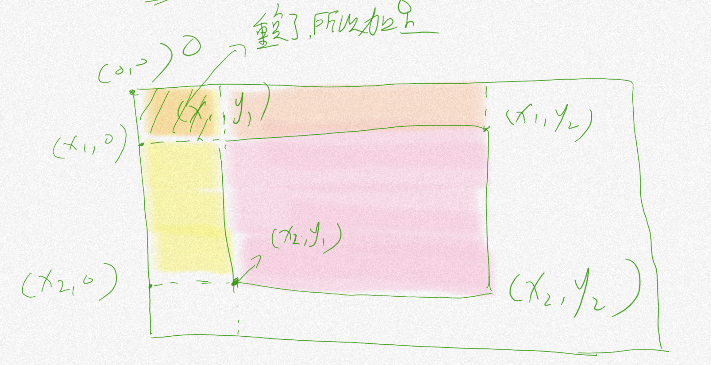

# 前缀和与差分

## 前言

配套视频：

[www.bilibili.com/video/BV1xq4y1y7Kz](https://www.bilibili.com/video/BV1xq4y1y7Kz)


## 一、前缀和

### 1.1什么是前缀和

前缀和是一种重要的预处理，能大大降低查询的时间复杂度。常常用于一些题目的优化，其实前缀和是一种思想，主要是维护 **离线区间信息** 的一种优化手段

最简单的一道题就是给定 n 个数和 m 次询问，每次询问一段区间的和。求一个 O(n + m) 的做法。

### 1.2一维前缀和

#### 1.2.1问题引出

例题：[http://acm.mangata.ltd/p/P1501](http://acm.mangata.ltd/p/P1501)

#### 1.2.2思路

对于一维前缀和我们在输入数据的时候就能进行处理，假设前缀和数组是pre，那么我们的`pre[i] = pre[i-1]+a[i]`，这样就维护了一个前缀，注意的是这里的i从1开始遍历

代码示例：

```c++
for(int i = 1;i <= n; ++i) {
    cin>>a[i];
    pre[i] = pre[i-1] + a[i];
}
```

这样我们就得到了一维前缀和的一个数组，那么这个数组可以干什么事呢？首先我们能在$O(1)$的时间复杂度内求出任一一个区间的和例如我们要求$[L,R]$区间和，即`pre[R]-pre[L-1]`，

### 1.3一维前缀积

#### 1.3.1问题引出

例题：[https://ac.nowcoder.com/acm/contest/19483/A](https://ac.nowcoder.com/acm/contest/19483/A)

#### 1.3.2思路

由于有前缀和这种操作，我能够意识到这是一种思想，顺着这个思想我们能想到前缀积这个操作，和前缀和相似我们通过对pre数组进行乘法更新然后 **不断取模** 就能得到一个前缀积，如果我们想获得$[L,R]$的区间积那么需要用到 **逆元** 的操作即$ans = pre[R] \times inv(pre[L-1])$

代码示例：

```c++
pre[0] = 1;//否则全都变成0了
for(int i = 1;i <= n; ++i) {
    cin>>a[i];
    pre[i] = pre[i-1] * a[i] % mod;
}
求[L,R]区间内前缀积
ans = pre[R] * inv(pre[L-1]);
```


### 1.4 一维前缀异或

和上面类似，只不过维护的是异或和

### 1.5二维前缀和

#### 1.5.1问题引出

例题：[https://www.luogu.com.cn/problem/P2004](https://www.luogu.com.cn/problem/P2004)

#### 1.5.2思路

对于二维前缀和同理，我们从维护线前缀和变成了矩阵前缀和，换句话说就是从维护一维前缀和变成了维护二维前缀和。我们此时的`pre[i][j]`表示的含义就是从左上角`[1][1]`到右下角`[i][j]`这个矩阵的一个和，因此我们能写出这样一个维护代码$pre[i][j]=pre[i-1][j] + pre[i][j-1] - pre[i-1][j-1] + a[i][j]$，这个也是很好理解的，现在我们如果要求一个左上角为$x_1,y1$，右下角为$x_2,y_2$的矩阵和就可以这样写：$ans=pre[x2][y2]-pre[x2][y1-1]-pre[x1][y2-1]+pre[x1-1][y1-1]$

我们可以来看这样一张图：



对于粉色部分就是我们想要求得的矩阵范围，对于黄色，和棕色部分就是我们多余的范围，需要减去，但是在减的过程中会遇到减的区间重复的情况，所以我们需要加上$pre[x1-1][y1-1]$的操作

代码实现：

```c++
for(int i = 1;i <= n; ++i) {
    for(int j = 1;j <= m; ++j) {
        cin>>a[i][j];
        pre[i][j] = pre[i-1][j] + pre[i][j-1] - pre[i-1][j-1] + a[i][j];
    }
}
ans=pre[x2][y2]-pre[x2][y1-1]-pre[x1-1][y2]+pre[x1-1][y1-1];
```


### 1.5优缺点

优点很显然，就是能快速求出区间或者矩阵的 **一些信息** 例如和、积、异或等

缺点也很显然，就是 **不能在线操作** ，只能 **离线处理** ，遇到一个动态变化的就不能使用前缀和操作。

## 二、差分数组

### 2.1定义

对于已知有n个元素的离线数列d，我们可以建立记录它每项与前一项差值的差分数组$f$：显然，$f[1]=d[1]-0=d[1];$对于整数$i∈[2,n]$，我们让$f[i]=d[i]-d[i-1]$。

### 2.2性质

- 计算数列各项的值：观察$d[2]=f[1]+f[2]=d[1]+d[2]-d[1]=d[2]$可知，数列第$i$项的值是可以用差分数组的前$i$项的和计算的，即$d[i]=f[i]$的前缀和。
- 第$i$项的前缀和即为数列前$i$项的和

通过以上两点性质我们能在$O(N)$的时间复杂度内求出区间和以及每个位置的值，带来的好处就是能快速处理区间加减操作

### 2.3使用

对于区间$[L,R]$的增加一个x，那么在差分数组上我们进行的操作就是$f[L]+x,f[R+1]-x$，为什么呢？我们来回顾一下对于差分数组求前$i$项前缀和求出来的就是$d[i]$，那么我们在$f[L]$的位置进行一个加法操作也就是让从L这个位置开始的后面所有的d进行一个+x的操作，对于$F[R+1]-x$其实就是让R+1到后面所有元素减去x，因为前面在L这个位置进行了以后所有元素+x这个操作

这样一来区间修改再求单点的值或者区间值的话复杂度就是$O(N)$的，其实到后面我们会去学习一种数据结构->树状数组，我们利用差分这个性质的话，在$O(log_n)$的时间复杂度就能求到单点和区间值，现在我们就不做探究了，其实差分重要的不是差分数组，而是  **差分思维** 。

## 三、练习题单

洛谷题单：[https://www.luogu.com.cn/training/200](https://www.luogu.com.cn/training/200)

牛客：[https://ac.nowcoder.com/acm/contest/19483](https://ac.nowcoder.com/acm/contest/19483)

牛客的BCD可能有点难，可以不用去做