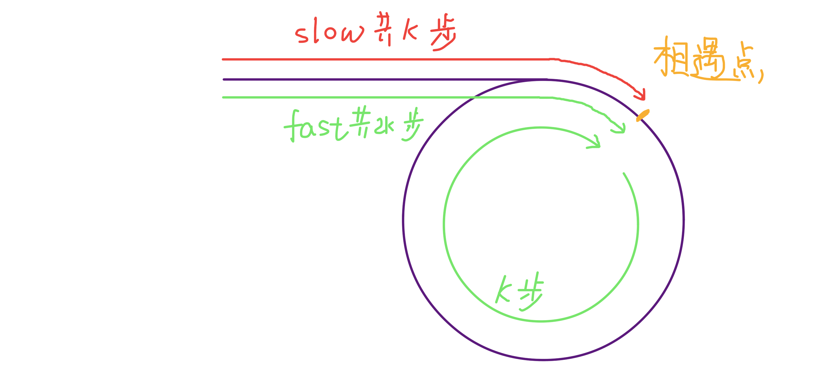

**长文预告！！！**


# 双指针算法
双指针又被称为 **尺取法** 双指针是一种简单而又灵活的技巧和思想，并不是一种具体的算法，单独使用可以轻松解决一些特定问题，和其他算法结合也能发挥多样的用处。

双指针顾名思义，同时使用两个指针维护或者是统计一些区间信息的。特别是在数组、链表等数据结构中，双指针的算法能大大减少我们的编码速度以及时间复杂度，双指针大体的应用分为以下三个大类： **滑动窗口** 、 **碰撞指针** 、 **快慢指针** 

## 一、滑动窗口

### 1.1 维护区间和|积

#### 1.1.1 问题引出
>选自[Subsequence (POJ No.3061)](http://poj.org/problem?id=3061)

> 给定长度为 $N \ (10 < N <10^5)$ 的正整数数列 $a_0,a_1,……,a_{n-1}$ 以及正整数 $S \ (0 < S < 10^8)$ 。求出总合不小于S的 **连续** 子序列长度的最小值。如果解不存在，则输出0

> 样例：
```
10 15
5 1 3 5 10 7 4 9 2 8
```
```output
2
```
#### 1.1.2 朴素想法
我们枚举子序列的左端点，然后再枚举长度，以及再一个循环来计算 $[l,r]$  这个区间的一个权值和，然后从满足条件的序列里面挑选出最短的一个，那么复杂度就为 $O(N^3)$ , 代码如下：

```cpp
#include<iostream>
#include<algorithm>
using namespace std;

#define ll long long

const int N = 1e5+10;
ll a[N],S,n;

int main()
{
	int t;
	cin>>t;
	while(t--){
		cin>>n>>S;
		int ans = 0x3f3f3f3f;
		for(int i = 1;i <= n; ++i) cin>>a[i];
		for(int l = 1;l <= n; ++l){
			for(int len = 1;l + len - 1 <= n; ++len) {
				int r = l + len - 1;
				ll sum = 0;
				for(int j = l;j <= r; ++j)
					sum += a[j];
				if(sum >= S) 
					ans = min(ans,len);
			}
		}
		if(ans == 0x3f3f3f3f) cout<<0<<endl;
		else cout<<ans<<endl;
	}
	
	return 0;
}
```
#### 1.1.3 前缀和优化
当然 $O(N^3)$ 的复杂度远远不够，于是我们发现在最内层的计算区间和的循环可以用前缀和优化掉，那么优化后代码如下：
```cpp
#include<iostream>
#include<algorithm>
using namespace std;

#define ll long long

const int N = 1e5+10;
ll a[N],S,n,pre[N];

int main()
{
	int t;
	cin>>t;
	while(t--){
		cin>>n>>S;
		int ans = 0x3f3f3f3f;
		for(int i = 1;i <= n; ++i) cin>>a[i],pre[i]=pre[i-1] + a[i];
		for(int l = 1;l <= n; ++l){
			for(int len = 1;l + len - 1 <= n; ++len) {
				int r = l + len - 1;
				ll sum = pre[r]-pre[l-1];
				if(sum >= S) 
					ans = min(ans,len);
			}
		}
		if(ans == 0x3f3f3f3f) cout<<0<<endl;
		else cout<<ans<<endl;
	}
	
	return 0;
}
```
#### 1.1.4 二分优化
现在我们以及将复杂度降到了 $O(N^2)$ 了，但是对于这个问题而言，显然是不够看的，于是我们得再想一下优化，不难发现由于数组中的元素都是正整数，那么说明我们的前缀和是一个单调递增的序列，那么我们就能通过二分法来加速我们寻找可行长度，而不是从1开始枚举，于是我们得到了这样的代码：

```cpp
#include<iostream>
#include<algorithm>
using namespace std;

#define ll long long

const int N = 1e5+10;
ll a[N],S,n,pre[N];

int main()
{
	int t;
	cin>>t;
	while(t--){
		cin>>n>>S;
		int ans = 0x3f3f3f3f;
		for(int i = 1;i <= n; ++i) cin>>a[i],pre[i] = pre[i-1] + a[i];
		for(int l = 1;l <= n; ++l){
			int r = lower_bound(pre+1,pre+n+1,S+pre[l-1]) - pre;
			if(r > n) continue;
			ans = min(ans,r-l+1);
		}
		if(ans == 0x3f3f3f3f) cout<<0<<endl;
		else cout<<ans<<endl;
	}
	
	return 0;
}
```
此时我们的时间复杂度为 $O(Nlog_N)$ ，对于这一道题来说算是绰绰有余了，但是这不是最优解或者说不算一个比较理想的解法

#### 1.1.5 双指针做法
于是引出了我们今天的主角 ： **“双指针算法”** 

- 1.我们定义两个指针： $l$ 和 $r$ 在初始时刻都指向第一个元素，并且将子区间的和置为 $a[1]$ 

- 2.然后我们挪动 $r$ 指针一直到大于等于 $S$ 位置，然后我们 **统计当前的长度** ，后面的完全不用去遍历了，因为前缀和是单调递增的所以当前位置就是最优的

- 3.然后我们将左指针 $l$ 往右移动一位，

- 4.然后再看 $r$ 指针是否能移动，也就是重复上面的 $r$ 指针移动的过程，最后如果我们发现 $r$ 指针以及移动到末尾了，并且当前的和还是小于 $S$ 的，那么说明后面也不可能再有这种区间满足条件了，所以可以直接 `break` 

最后我们的ans如果没更新的话说明就没有满足的区间，当然这个也可以通过求和判断是否会存在

上面样例的一个图解：


那么我们不难得出如下代码：

```cpp
#include<iostream>
#include<algorithm>
using namespace std;

#define ll long long

const int N = 1e5+10;
ll a[N],S,n,pre[N];

int main()
{
	int t;
	cin>>t;
	while(t--){
		cin>>n>>S;
		int ans = 0x3f3f3f3f;
		for(int i = 1;i <= n; ++i) cin>>a[i];
		int l = 1,r = 1;
		ll sum = a[1];
		while(r <= n) {
			while(r <= n && sum < S) sum += a[++r];
			if(sum < S) break;
			ans = min(ans,r-l+1);
			sum -= a[l++];
		}
		if(ans == 0x3f3f3f3f) cout<<0<<endl;
		else cout<<ans<<endl;
	}
	
	return 0;
}
```

我们来分析这个代码的复杂度，对于 $l$ 和 $r$ 指针我们没有进行回溯操作，也就是说对于两个指针而言最多覆盖整个数组长度，也就是 $O(N)$ 的，并且在思路上双指针的做法也会比前缀和+二分优化好，空间利用率也比较高，但是有的时候可能双指针会搭配二分一起用，这些东西就需要读者刷题踩坑啦，我就不多赘述了。

### 1.2 最小可行区间

#### 1.2.1 问题引出
>选自 [Jessica’s Reading Problem (POJ No.3320)](http://poj.org/problem?id=3320)

>为了准备考试，$Jessica$ 开始读一本很厚的课本。要想通过考试，必须把课本中所有的知识点都掌握。这本书总共有P页，第 $i$ 页恰好有一个知识点 $a_i$ (每个知识点都有一个整数编号 ）。全书中同一个知识点可能会被多次提到，所以她希望通过阅读其中连续的一些页把所有的知识点都覆盖到。给定每页写到的知识点，请求出要阅读的最少页数。

> 样例：
输入：
```
5
1 8 8 8 1
```
输出：
```
2
```
#### 1.2.2 思路
首先我们要统计有多少本书（数量为 $len$ ），这个我们可以用 `set` 或者 `map` 容器来统计，然后同样的

- 1.我们定义 $l$ 和 $r$ 两个指针,两者都初始化为首位置 $1$ 统计访问次数的可以使用 `map<int,int>` 容器来存储信息
- 2.然后我们将 $r$ 指针不断往后移动直到满足不同书本数 $res$ 和 $len$ 相等，在将 $r$ 指针不断后移的过程中，我们只计算当前访问次数值为0的书本数即可（即出现新书的时候我们的数的种类res才会更新）
- 3.如果我们发现循环结束后我们的 $res$ 即书本数量比 $n$ 小的话说明后面也不再可能会有满足条件的子序列了
- 4.然后我们统计当前的长度，并更新 $ans$ 的结果，同时将 $l$ 指针右移一步

于是我们就能得到如下代码：
```cpp
#include<iostream>
#include<algorithm>
#include<cstdio>
#include<set>
#include<map>
using namespace std;

#define ll long long

const int N = 1e5+10;
int a[N],n;

int main()
{
	scanf("%d",&n);
	set<int> S;
	for(int i = 1;i <= n; ++i) scanf("%d",&a[i]),S.insert(a[i]);
	int len = S.size();
	map<int,int> vis;
	vis.clear();
	int l = 1,r = 1,res = 0;
	int ans = 0x3f3f3f3f;
	while(l <= r){
		while(r <= n && res < len){
			if(vis[a[r]] == 0) res++;
			vis[a[r++]]++;
		}
		if(res < len) break;
		ans = min(ans,r-l);
		if(--vis[a[l++]] == 0) res--;
	}
	printf("%d\n",ans);
	return 0;
}
```
注意这里的写法和上面的有点不太一样，就在于第一个位置我们在这里并没有直接算上，是因为不算上的话在后面的处理中不用考虑边界情况，这一点读者们可以自己下来手动模拟一下

### 1.3 固定窗口滑动

#### 1.3.1 问题引出

> 给定长度为 $n \ (k <= n <= 10^6)$ 的数列 $a_0 a_1 a_2 …… a_{n-1} \ (0 <= a_i <= 10^9)$ 求解区间长度为 $k (1<=k<=n)$ 的子串的最大值

#### 1.3.2 思路

这个题比较简单，我们很容易想到了先预处理出前 $n$ 个数的前缀和，然后我们遍历枚举左区间就好了,但是通过双指针或者是说滑动窗口的方法能更 **“优雅”** 的解决这个问题，我们先将前k个数的值加起来，然后我们定义 $l$ 指针指向第一个位置， $r$ 指针指向第k个位置，然后不断将 $l$ 和 $r$ 指针右移，在移动地过程中我们会发现其实 $[l,r]$ 区间的和会增加 $a[r+1] - a[l]$ ，那么我们只需要一层循环遍历就好了，于是得到如下代码：

```cpp
#include<iostream>
#include<algorithm>
#include<cstdio>
using namespace std;
const int N = 1e5+10;
int a[N],n,k;

int main()
{
	cin>>n>>k;
	for(int i = 1;i <= n; ++i) cin>>a[i];
	
	int l = 1,r = 1;
	int res = 0;
	while(r <= k) res += a[r++];
	int ans = res;
	for(;r <= n; ++r,l++){
		res += a[r]-a[l];
		ans = max(ans,res);
	}
	cout<<ans<<endl;
	
	return 0;
}
```

### 1.4 最长不重复子串

#### 1.4.1 问题引出

>给定一个长度为 $n \ (n<=10^7)$ 的字符串 ，求一个最长的满足所有字符不重复的子串

#### 1.4.1 朴素想法
我们枚举字符串的左区间，然后再开一层循环枚举从当前点开始的字符串，发现有重复的字符（这个可以通过开一个长度为 $300$ 的数组或者直接用map来统计）就停止当前枚举，否则就不断更新长度值 $ans$ ，那么可以得到如下代码：

```cpp
#include<iostream>
#include<algorithm>
#include<map>
using namespace std;

#define ll long long

const int N = 1e5+10;
int a[N],n,k;

int main()
{
	string s;
	cin>>n>>s;
	map<char,bool> vis;
	int ans = 0;
	for(int i = 0;i < n; ++i) {
		int res = 0;
		vis.clear();
		for(int j = i;j < n; ++j)
			if(vis[s[j]]) break;
			else vis[s[j]] = true,res++;
		ans = max(ans,res);
	}
	cout<<ans<<endl;
	return 0;
}
```

那么我们这个做法的的复杂度就为 $O(N^2)$ 显然当 $n$ 的范围小于 $10^4$ 的时候看起来是可行的，但是我们现在的复杂度高达 $10^7$ ！，于是我们得想一下优化

#### 1.4.2 双指针做法
我们思考上面的做法，每次遇到一个重复字符串我们的 $j$ 指针就回溯了，但是其实没必要回溯，因为此时的长度是从上一个 $s[j]$ 重复点到这个点的最长距离了，例如我们有一个字符串 `afbcdbekpm` 当我们的i指针指向的 **a** 且j指针指向了第二个 **b** 的时候我们会发现i指针在第一个 $b$ 之前（包含b）的位置的一个不重复字符串的长度都是要低于我们现在求得的 $[1,5]$ 的长度的，因为都会在第二个 **b** 停下来，但是左边的区间却缩小了，所以我们只需要不断移动 $i$ 指针并到达第一个 **b** 的位置即可， $j$ 指针就不用回溯了，那么对于两个指针都是最多走 $O(N)$ 步，那么总体的时间复杂度就是 $O(N)$ ,于是我们得到如下代码：

```cpp
#include<iostream>
#include<algorithm>
#include<map>
using namespace std;

#define ll long long

const int N = 1e5+10;
int n,k;

int main()
{
	string s;
	cin>>n>>s;
	map<char,bool> vis;
	int ans = 0;
	int l = 0,r = 0;
	for(;l < n; vis[s[l++]] = false) {
		while(r < n && vis[s[r]] == false) 
			vis[s[r++]] = true;
		ans = max(ans,r-l);
	}
	cout<<ans<<endl;
	return 0;
}
```

### 1.5 子序列匹配

#### 1.5.1 问题引出
选自 [leetcode 524. 通过删除字母匹配到字典里最长单词](https://leetcode-cn.com/problems/longest-word-in-dictionary-through-deleting/)

>给定一个字符串 $s$ 和一个字符串数组 $dictionary$ 作为字典，找出并返回字典中最长的字符串，该字符串可以通过删除 $s$ 中的某些字符得到。如果答案不止一个，返回长度最长且字母序最小的字符串。如果答案不存在，则返回空字符串。

样例：

>输入: s = "abpcplea", dictionary = ["ale","apple","monkey","plea"]

>输出："apple"

#### 1.5.2 思路
我们分析这个问题其实是寻找 $dictionary$ 中的最长的能成为 $s$ 的子序列的 $t$ 的长度，于是我们将两个指针一个 $i$ 放在 $s$ 开始位置，一个 $j$ 放在 $t$ 开始位置，如果 $s[i]=t[j]$ 说明 $t$ 的第 $j$ 位已经在 $s$ 中找到了第一个对应，可以进而检测后面的部分了，那么 $i$ 和 $j$ 同时加一。如果上述等式不成立，则 $t$ 的第 $j$ 位仍然没有被匹配上，所以只给 $i$ 加一，在 $s$ 的后面部分再继续寻找。最后，如果 $j$ 已经移到了末尾，说明整个字符串都可以被匹配上，也就是  是 $s$ 的一个子序列，否则不是。然后我们根据是否匹配成功来判断当前字符串是否能更新我们的答案，于是我们得到如下代码：
```cpp
string findLongestWord(string s, vector<string>& dictionary) {
        string ans = "";
        int l = s.size(),ans_len = 0;
        for(auto t : dictionary){
            int n = t.size();
            int i = 0,j = 0;
            while(i < l && j < n)
                if(s[i] == t[j]) ++i,++j;
                else ++i;
            if(j >= n){
                if(n == ans_len) ans = min(ans,t);
                else if(n > ans_len) ans = t,ans_len = n;
            }
        }
        return ans;
    }
```

## 二、碰撞指针

### 2.1 反转数组
这是最简单的碰撞指针了，我们定义左指针 $l$ 并指向数组的左区间，然后定义右指针 $r$ 并指向数组的右区间，然后不断向中间移动，直到相撞就停止，于是我们得到如下代码：

```cpp
void reverseStr(char *S){
	int r = strlen(S)-1,l = 0;
	while(l < r) swap(S[l++],S[r--]);
}
```

### 2.2 N数和问题

#### 2.2.1 问题引出

引自 [leetcode 167. 两数之和 II - 输入有序数组](https://leetcode-cn.com/problems/two-sum-ii-input-array-is-sorted/)

> 给定一个已按照 **升序排列** 的整数数组 $numbers$ ，请你从数组中找出两个不同位置的数满足相加之和等于目标数 $target$ 并输出两数在数组中的位置（从 $1$ 开始计算）。

#### 2.2.2 分析
有一个很关键的信息 **升序排列** ，那么我们很容易想到枚举第一个点的数，然后二分，虽然二分也是比较迅速且方便，但是时间复杂度还是会多个 $log_2n$ ，那么如果我们要用双指针怎么来解决呢，既然要找到两个数，且这两个数不能在同一位置，那其位置一定是一左一右。由于两数之和固定，那么两数之中的小数越大，大数越小。考虑到这些性质，那我们不妨从两边接近它们。

我们首先假设答案就是由 $a[1]$ 和 $a[n]$ 构成的，如果说 $a[1] + a[n] > target$ 那么我们要想将两数和变小，而对于左边的指针来说来说已经不能变得更小了，因为已经在整个数组的最左边了，那么我们只能将右边的指针往左移动

如果此时发现 $a[1] + a[n] < target$ 那么我们就要将左边的指针右移,因为右边的指针已经不能变得更大了，因为已经在整个数组的最右边了，那么我们只能将左边的指针往右移动

推广到一般情形，如果此时我们两个指针分别指在 $l,r$ 上，且 $l < r$ , 如果 $a[l] + a[r] > target$ ，就将 $r$ 减一，如果 $a[l] + a[r] < target$ ，就将 $l$ 加一。这样 $l$ 指针不断右移，$r$  指针不断左移，最后两者各逼近到一个答案，就是我们要求的两个位置

于是我们能得到如下代码：

```cpp
vector<int> twoSum(vector<int>& numbers, int target) {
        int l = 0,r = numbers.size()-1;
        while(l < r)
            if(numbers[l] + numbers[r] > target) r--;
            else if(numbers[l] + numbers[r] == target) break;
            else  l++;
        return (vector<int>){l+1,r+1};
    }
```

#### 2.2.3 快排中的对碰指针

我们在快速排序的划分界限的时候其实就用到了对碰指针，假设我们定义一个界限位置 $x$ ，然后我们将这个数组所有大于 $a[x]$ 的数放到 $x$ 的右边，然后将所有小于等于 $a[x]$ 的数放在 $x$ 位置的左边，我们定义两个指针分别指向最左边和最右边，然后两个指针都往中间走，然后左边遇到大于我们选中的x值就停下来，右边就遇到小于我们选择的 $x$ 值就停下来，然后交换两数，然后重复这个过程，直到两个指针相遇就完成了我们的划分，即 $x$ 左边的都小于等于 $a[x]$ ，$x$ 右边的都大于等于 $a[x]$

于是我们能得到如下代码：（截取代码段）
```cpp
int x = a[l+r>>1],i=l-1,j=r+1;
while(i < j) {
	while(a[++i] < x);
	while(a[--j] > x);
	if(i < j) swap(a[i],a[j]);
}
```

## 三、快慢指针
快慢指针是指的，我们定义两个指针 $low$ 和 $fast$ ，两者都往同一个方向前进，但是两个指针移动的速度不同，或者相同的速度，但是移动的契机不同，这种形成一快一慢的形式就是我们的快慢指针拉

### 3.1 计算链表的中点
定义两个指针分别为 慢指针 $low$ 和快指针 $fast$ 都从头节点 `head` 出发，每轮迭代移动中，快指针向前移动 **两个节点** ，慢指针向前移动一个节点，最终当快指针到达终点的时候，慢指针刚好在中间的节点。

注意的是，这里的节点个数与中间节点的关系（头节点算第一个节点），如果是奇数个节点的话，那么我们的 $low$ 指针刚好走到中间，但是如果是偶数个节点的话，我们的节点会走到右边去，这里根据题目的需求输出对应的答案就好了，比如说如果我们想走到左边那一个那么我们走 $fast$ 指针如果发现不能移动两步， $low$ 指针就不移动了，下面给出两种场景的图解：


由于代码比较简单，就请读者自己书写啦

### 3.2 判断链表是否有环

#### 3.2.1 问题引出
选自：[leetcode.141 环形链表](https://leetcode-cn.com/problems/linked-list-cycle/)

>给你一个链表的头节点 head ，判断链表中是否有环。

>如果链表中有某个节点，可以通过连续跟踪 next 指针再次到达，则链表中存在环。 为了表示给定链表中的环，评测系统内部使用整数 pos 来表示链表尾连接到链表中的位置（索引从 0 开始）。注意：pos 不作为参数进行传递 。仅仅是为了标识链表的实际情况。

>如果链表中存在环 ，则返回 true 。 否则，返回 false 。

#### 3.2.2 思路
如果说链表中有环，那么我们的快慢指针  $fast$ 和 $low$ 如果都进入了这个环中，那么它们就会在里面转圈，因为我们定义的 $fast$ 每次移动两步， $low$ 每次移动一步，对于每一次移动 $fast$ 指针都会比 $low$ 指针多移动一步，那么说明这两个指针迟早会在环里面相遇（如果存在环的话）我们就返回 `true` 即可，否则我们的 $fast$ 指针遇到了一个 $NULL$ 节点就直接返回 `false` 即可。于是我们得到如下代码：

```cpp
bool hasCycle(ListNode *head) {
	ListNode * fast,*low;
	fast = low = head;
	while(fast != NULL && fast->next != NULL){
		fast = fast->next->next;
		low = low->next;
		if(fast == low) return true;
	}
	return false;
}
```

```java
boolean hasCycle(ListNode head) {
    ListNode fast, slow;
    fast = slow = head;
    while (fast != null && fast.next != null) {
        fast = fast.next.next;
        slow = slow.next;
        if (fast == slow) return true;
    }
    return false;
}

```

### 3.3 判断链表中环的起点

#### 3.3.1 问题引出

选自：[leetcode 142. 环形链表 II](https://leetcode-cn.com/problems/linked-list-cycle-ii/)

> 给定一个链表的头节点 `head` 返回链表开始入环的第一个节点。如果链表无环，则返回 `null` 。

>如果链表中有某个节点，可以通过连续跟踪 `next` 指针再次到达，则链表中存在环。 为了表示给定链表中的环，评测系统内部使用整数 `pos` 来表示链表尾连接到链表中的位置 **（索引从 0 开始）** 。如果 `pos` 是 `-1` ，则在该链表中没有环。注意：`pos` 不作为参数进行传递，仅仅是为了标识链表的实际情况。

> **不允许修改** 链表。


#### 3.3.2 思路
熟悉 `STL` 的同学估计一瞬间就想到了用一个 `map<ListNode*,bool>` 来统计每一个节点是否被访问过，如果我们对一个节点访问了 **第二次** ，说明这个点就是我们环的起点，于是我们能得到如下代码：

```cpp
ListNode *detectCycle(ListNode *head) {
        map<ListNode*,bool> vis;
        while(head != NULL){
            if(vis[head]) return head;
            vis[head] = true;
            head = head->next;
        }
        return NULL;
    }
```

简短有力，但是这不是我们今天要讲的，我们有一种更加 **"优雅"** 的做法，即双指针:

我们假设第一次相遇时慢指针 $low$ 走了 $k$ 步那么快指针 $fast$ 一定走了 $2k$ 步，也就是说比 $low$ 多走了 $k$ 步（也就是环的长度）。



设相遇点距环的起点的距离为 $m$ ，那么环的起点距头结点 $head$ 的距离为 $k - m$ ，也就是说如果从 $head$ 前进 $k - m$ 步就能到达环起点。巧的是，如果从相遇点继续前进 $k - m$ 步，也恰好到达环起点。

所以，只要我们把快慢指针中的任一个重新指向 head，然后两个指针同速前进，k - m 步后就会相遇，相遇之处就是环的起点了。


于是我们得到如下代码：
```cpp
ListNode *detectCycle(ListNode *head) {
	ListNode * fast,*low;
	fast = low = head;
	while(fast != NULL && fast->next != NULL){
		fast = fast->next->next;
		low = low->next;
		if(fast == low) break;
	}
	if(fast == NULL || fast->next == NULL) return NULL;
	fast = head;
	while(fast != low) 
		fast=fast->next,low=low->next;
	return low;
}
```

### 3.4 求链表中环的长度
上面也已经提过了,如果存在环的话，我们在两个指针相遇后，停止两个指针的其中一个，然后让另一个继续走，直到再次相遇，那么走的这个指针的走过的路径长度就是链表中环的长度，不难得到如下代码：

```cpp
ListNode *GetCycleLen(ListNode *head) {
	ListNode * fast,*low;
	fast = low = head;
	while(fast != NULL && fast->next != NULL){
		fast = fast->next->next;
		low = low->next;
		if(fast == low) break;
	}
	if(fast == NULL || fast->next == NULL) return 0;
	int ans = 0;
	while(fast != low) 
		low=low->next,ans++;
	return ans;
}
```


### 3.5 求链表倒数第k个元素

#### 3.5.1 问题引入

选自：[leetcode 剑指 Offer 22. 链表中倒数第k个节点](https://leetcode-cn.com/problems/lian-biao-zhong-dao-shu-di-kge-jie-dian-lcof/)

>输入一个链表，输出该链表中倒数第 $k$ 个节点。为了符合大多数人的习惯，本题从 $1$ 开始计数，即链表的尾节点是倒数第 $1$ 个节点。

>例如，一个链表有 $6$ 个节点，从头节点开始，它们的值依次是 $1、2、3、4、5、6$ 。这个链表的倒数第 $3$ 个节点是值为 $4$ 的节点。

我们只需要让快指针 $fast$ 先移动k个位置，然后我们同时同步移动快慢指针，直到快指针到达 `NULL` 此时的慢指针 $low$ 指向的位置就是链表倒数第k个元素的位置，于是我们不难得到如下代码：

```cpp
ListNode* getKthFromEnd(ListNode* head, int k) {
        ListNode *fast, *low;
        fast = low = head;
        while(k--) fast=fast->next;
        while(fast != NULL)
            fast=fast->next,low=low->next;
        return low;
    }
```

## 后言

对于双指针来说其实比较宽泛，而且非常灵活，需要读者多写才能掌握，目前就先介绍这些内容吧，其实开始我只是想介绍一下关于滑动窗口部分的双指针，在查阅网上一些资料后，没想到越写越多，如果遇到一些新的技巧我会持续更新的，下面就是训练题单环节了：

|题目|链接|题解|
|:--|:--|:--|
|Subsequence|[http://poj.org/problem?id=3061](http://poj.org/problem?id=3061)|见上面|
|乘积小于K的子数组|[https://leetcode-cn.com/problems/subarray-product-less-than-k/](https://leetcode-cn.com/problems/subarray-product-less-than-k/)||
|Jessica's Reading Problem|[http://poj.org/problem?id=3320](http://poj.org/problem?id=3320)|见上面|
|通过删除字母匹配到字典里最长单词|[https://leetcode-cn.com/problems/longest-word-in-dictionary-through-deleting/](https://leetcode-cn.com/problems/longest-word-in-dictionary-through-deleting/)|见上面|
|两数之和 II - 输入有序数组|[https://leetcode-cn.com/problems/two-sum-ii-input-array-is-sorted/](https://leetcode-cn.com/problems/two-sum-ii-input-array-is-sorted/)|见上面|
|环形链表|[https://leetcode-cn.com/problems/linked-list-cycle/](https://leetcode-cn.com/problems/linked-list-cycle/)|见上面|
|环形链表 II|[https://leetcode-cn.com/problems/linked-list-cycle-ii/](https://leetcode-cn.com/problems/linked-list-cycle-ii/)|见上面|
|链表中倒数第k个节点|[https://leetcode-cn.com/problems/lian-biao-zhong-dao-shu-di-kge-jie-dian-lcof/](https://leetcode-cn.com/problems/lian-biao-zhong-dao-shu-di-kge-jie-dian-lcof/)|见上面|
|三数之和|[https://leetcode-cn.com/problems/3sum/](https://leetcode-cn.com/problems/3sum/)||
|绝对差不超过限制的最长连续子数组|[https://leetcode-cn.com/problems/longest-continuous-subarray-with-absolute-diff-less-than-or-equal-to-limit/](https://leetcode-cn.com/problems/longest-continuous-subarray-with-absolute-diff-less-than-or-equal-to-limit/)||
|救生艇|[https://leetcode-cn.com/problems/boats-to-save-people/](https://leetcode-cn.com/problems/boats-to-save-people/)||
|R|[https://ac.nowcoder.com/acm/contest/23479/A](https://ac.nowcoder.com/acm/contest/23479/A)|[https://acmer.blog.csdn.net/article/details/122837067](https://acmer.blog.csdn.net/article/details/122837067)|
|懒惰的牛|[https://www.acwing.com/problem/content/1924](https://www.acwing.com/problem/content/1924/)|[https://acmer.blog.csdn.net/article/details/122801496](https://acmer.blog.csdn.net/article/details/122801496)|
|贝茜放慢脚步|[https://www.acwing.com/problem/content/description/1936/](https://www.acwing.com/problem/content/description/1936/)|[https://acmer.blog.csdn.net/article/details/122794773](https://acmer.blog.csdn.net/article/details/122794773)|
|智乃的密码|[https://ac.nowcoder.com/acm/contest/23478/I](https://ac.nowcoder.com/acm/contest/23478/I)|[https://acmer.blog.csdn.net/article/details/122790920](https://acmer.blog.csdn.net/article/details/122790920)|