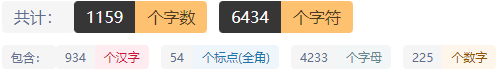

# Trie树

## 前言

配套视频：

[www.bilibili.com/video/BV14A411c7Dr](https://www.bilibili.com/video/BV14A411c7Dr)

## 一、Trie树简介

顾名思义，这棵树和字典类似，通过百度我们又能知道 **Trie树是一种树形结构** ，是一种 **哈希树** 的变种。典型应用是用于 **统计** ， **排序** 和 **保存大量的字符串** （但不仅限于字符串），所以经常被 **搜索引擎** 系统用于文本词频统计。它的优点是：利用字符串的公共前缀来减少查询时间，最大限度地减少无谓的字符串比较，查询效率比哈希树高。

我们可以先看一张图来演示Trie树的结构：


这张图已经很明显的告诉你了，这棵树的每一条边都代表着一个字符或者说除开根节点外其他点就是一个字符，我们通过这种方式就能实现类似字典的快速查找，但是显而易见的这样的结构对空间的浪费是巨大的

## 二、Trie树的基本性质

1，根节点不包含字符，除根节点意外每个节点只包含一个字符。

2，从根节点到某一个节点，路径上经过的字符连接起来，为该节点对应的字符串。

3，每个节点的所有子节点包含的字符串不相同。

## 三、Trie树的优缺点

### 3.1 优点

1.很明显，Trie树在插入字符串和查找字符串的效率是极高的

2.Trie树本身就是一颗排好序的树

3.Trie树在对与字符串匹配方面能有更多的操作

4.不会发生像hash一样的hash碰撞

### 3.2 缺点

1.很明显，Trie树是一种以时间换空间的做法，所以Trie树的空间花费非常大

2.对于较长字符串的处理，Trie树还不能解决，或者说会让Trie树的链变得很长导致炸空间等现象

## 四、为什么要学习Trie树

1.因为题目需要，很多题目都会出现对字符串的处理等等

2.学习Trie树能丰富我们的数据结构知识

3.Trie树能给我们提供一种很好的思维方式

4.Trie树是后续学习其他数据结构例如AC自动机、后缀自动机的辅助结构

## 五、Trie树的应用

### 5.1 字符串的快速匹配

通过Trie树我们可以实现O(m)复杂度的匹配

### 5.2 字符串排序

我们通过优先遍历字符序靠前的字符串即可获得

### 5.3 最长公共前缀的匹配

字典树会在插入字符串的时候统计每一个字符串的每一个字符的信息，通过这些信息我们就能知道当前匹配位置是否有公共前缀

## 六、代码实现

例题[luoguP2580](https://www.luogu.com.cn/problem/P2580)

```cpp
#include<cstdio>
#include<algorithm>
#include<cstring>
using namespace std;

const int N = 5e5+10;//请注意这里的数组大小要开字符串的个数*字符串的长度这么大
int n,m;
struct trie {
    int nextt[N][26],cnt;//nextt[i][j]存储的是第i个字符下一个字符j的位置信息
    int exit[N];//exit[i]表示以值为i结束的这个字符串是否存在
    void insert(char *s,int l) {
        int p = 0;//这个表示的是当前的位置指针
        for(int i = 0;i < l; ++i) {
            int c = s[i] - 'a';
            if(!nextt[p][c]) nextt[p][c] = ++cnt;//如果下面一层是空的，那么就更新下一层的值
            p = nextt[p][c];//更新当前的p指针
        }
        exit[p] = 1;
    }
    void find(char *s,int l) {
        int p = 0;
        for(int i = 0;i < l; ++i) {
            int c = s[i] - 'a';
            if(!nextt[p][c]) break;//这里表示没找到，那么我们直接退出即可
            p = nextt[p][c];
        }
        if(exit[p] == 1) {
            puts("OK");
            exit[p] = 2;
        }
        else if(exit[p] == 2) {
            puts("REPEAT");
        }
        else if(exit[p] == 0) {
            puts("WRONG");
        }
    }
}T;

char S[N];

int main()
{
    scanf("%d%d",&n,&m);
    for(int i = 0;i < n; ++i) {
        scanf(" %s",S);
        T.insert(S,strlen(S));
    }
    scanf("%d",&m);

    for(int i = 0;i < m; ++i) {
        scanf("%s",S);
        T.find(S,strlen(S));
    }
    return 0;
}
```

## 七、Trie树的衍生01-Trie

01Trie就像是Trie的一种简化版本，就是构建的树只有0和1，因为只有0和1我们很容易和位运算等运算联系起来，比如xor、&、|、等等，01字典树最常用的就是对xor求最大值的计算

### 7.1 01字典树的代码模板

例题：[Xor Sum](https://acm.hdu.edu.cn/showproblem.php?pid=4825)

```cpp
#include<cstring>
#include<algorithm>
#include<cstdio>
using namespace std;
#define ll long long
const int N = 1e5+10;
int n,m;
struct Trie {
    ll nextt[N*32][2];
    ll exit[N*32];
    ll cnt = 0;
    void init() {
    	memset(nextt,0,sizeof nextt);
    	memset(exit,0,sizeof exit);
    	cnt = 0;
	}
    
    void insert(ll k) {
        ll p = 0;
        for(int i = 32;i >= 0; --i) {
            ll c = (k>>i) & 1;
            if(!nextt[p][c]) nextt[p][c] = ++cnt;
            p = nextt[p][c];
        }
        exit[p] = k;
    }
    ll find(ll k) {
        ll p = 0;
        for(int i = 32;i >= 0; --i) {
            ll c = (k>>i) & 1;
            if(nextt[p][c^1]) p = nextt[p][c^1];
            else p = nextt[p][c];
        }
        return exit[p];
    }
}T;

int main()
{
	int t; 
	scanf("%d",&t);
	for(int j = 1;j <= t;++j) {
	    scanf("%d%d",&n,&m);
	    ll k;
	    T.init();
	    for(int i = 0;i < n; ++i) {
	        scanf("%lld",&k);
	        T.insert(k);
	    }
	    printf("Case #%d:\n",j);
	    while(m--) {
	        scanf("%lld",&k);
	        printf("%lld\n",T.find(k));
	    }
	}
    return 0;
}
```

## 八、练习题


| 题目                                      | 题目连接                                                     |
| ----------------------------------------- | ------------------------------------------------------------ |
| Babelfish                                 | [http://poj.org/problem?id=2503](http://poj.org/problem?id=2503) |
| Phone List                                | [https://acm.hdu.edu.cn/showproblem.php?pid=1671](https://acm.hdu.edu.cn/showproblem.php?pid=1671) |
| Xor Sum                                   | [https://acm.hdu.edu.cn/showproblem.php?pid=4825](https://acm.hdu.edu.cn/showproblem.php?pid=4825) |
| What Are You Talking About                | [https://acm.hdu.edu.cn/showproblem.php?pid=1075](https://acm.hdu.edu.cn/showproblem.php?pid=1075) |
| Beautiful Subarrays                       | [http://codeforces.com/problemset/problem/665/E](http://codeforces.com/problemset/problem/665/E) |
| 第八集 你明明自己也生病了，却还是要陪着我 | [http://120.78.128.11/Problem.jsp?pid=1928](http://120.78.128.11/Problem.jsp?pid=1928) |
| P2580 于是他错误的点名开始了              | [https://www.luogu.com.cn/problem/P2580](https://www.luogu.com.cn/problem/P2580) |
| Chip Factory                              | [https://www.luogu.com.cn/problem/U109897](https://www.luogu.com.cn/problem/U109897) |
| Nikitosh and xor                          | [https://www.luogu.com.cn/problem/U109923](https://www.luogu.com.cn/problem/U109923) |
| 最长异或路径                              | [https://www.luogu.com.cn/problem/P4551](https://www.luogu.com.cn/problem/P4551) |
| 阅读理解                                  | [https://www.luogu.com.cn/problem/P3879](https://www.luogu.com.cn/problem/P3879) |

