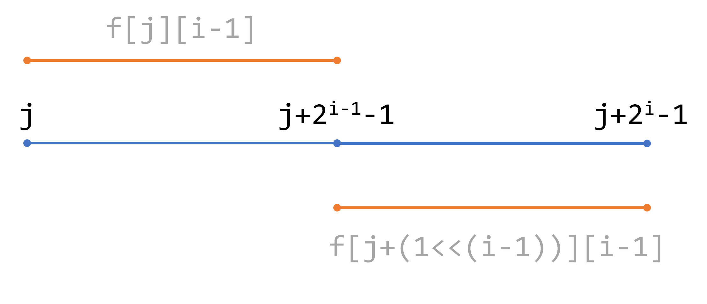
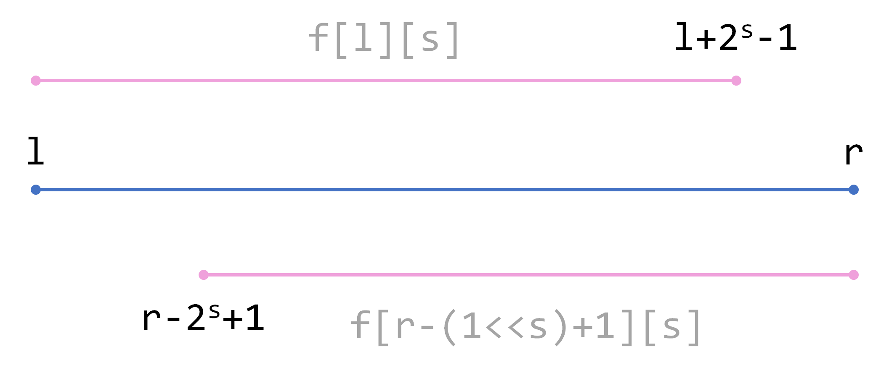

# ST表

## 前言

## 一、简介

> `ST` 表是一种基于 **倍增** 思想，用于解决 **可重复贡献问题** 的数据结构

关于上述提到的 **可重复贡献问题** 其中最出名的就是 `RMQ` 问题，即区间最大（小）值，虽然线段树也能解决这个问题，但是各有优缺点，首先两者的预处理复杂度都是 $nlog_2n$ 但是 `ST` 表的查询效率是 $O(1)$ 而线段树的效率是 $log_n$ 显然在一些大量区间重复贡献 **查询** 问题上来说， `ST` 表还是有一定的优势，但是 `ST` 表不支持数据的修改，也就是只能查，而线段树的修改和查询的复杂度都是 $log_2n$

如果按照 **一般的倍增** 思想的话，我们每次都是跳 $2^i$ 步，那么查询的复杂度还是 $log_2n$ 但是由于我们查询的数据是满足 **可重复贡献** 的，所以我们只需要提前处理一下重叠的区间（其实就是将当前的区间分成两部分查过的区间，然后合并查询一下）

## 二、原理

在上面的简介中其实也说了 `ST` 表的原理，其实就是将我们当前查询的区间分成两部分，假设我们用 $f[j][i]$ 表示 $[j,j+2^i-1]$ 这个区间的一个最大值，我们可以用下图来表示



前半段就是已经求出来的 $[j,j+2^{i-1}-1]$ 的区间最大值，而后半段就是 $[j+2^{i-1},j+2^i-1]$ 的区间最大值，那么整个 $[i,i+2^j-1]$ 区间的最大值就是两区间的最大值的最大值，也就是去一个 $max(max([j,j+2^{i-1}-1]),max([j+2^{i-1},j+2^i-1]))$ 即可

那么我们继续思考如何得到 $f[j][i]$ 的值呢？不难发现其实就是我们上面推导的式子： $f[j][i] = max(f[j][i-1],f[j+2^{i-1},i-1])$ 

其实这里也能看出 $2^i = 2^{i-1} + 2^{i-1}$ 

不难得出预处理的递推代码：

```cpp
void init(int n){
	for(int i = 1;i <= 20; ++i)
		for(int j = 1;(j+(1<<i)-1) <= n; ++j)
			f[j][i] = max(f[j][i-1],f[j+(1<<(i-1))][i-1]);
}

```
然后继续的问题就是对于一个区间的查询，我们怎么做到 $O(1)$ 的复杂度查询，假设当前的查询区间为 $[L,R]$

那么我们可以知道这个区间的长度为：
$len = R - L + 1$

我们希望能找到两个区间 $[l_1,r_1]，[l_2,r_2]$ 让这两个区间的并集为我们需要查询的区间 $[L,R]$ ，于是我们可以表示为这两个区间：

$[L,L+2^s-1]$ 和 $[R-2^s+1,r]$ 两个区间，那么我们肯定想让两个区间重合的高一点，毕竟在极限数据，例如区间长度为 $1、2$ 的时候也能覆盖上，那么我们会发现当 $L+2^s-1 = R$ 或者 $R-2^s+1 = L$ 的时候就是极限值了于是我们得到了 $s = log_2(R-L+1) = log_2(len)$




于是得到了查询的代码：
```cpp
inline int query(int L,int R){
	int s = log2(R-L+1);
	return max(f[L][s],f[R-(1<<s)+1][s]);
}
```

当然了，这样查询的话每次都要求一个 $log_2$ 可能会增加常数，于是我们可以对 $log_2$ 进行递推的预处理：

```cpp
for(int i = 2;i <= n; ++i)
    log2[i] = log2[i/2] + 1;
```


## 三、例题

### 3.1 题目连接
[P3865 【模板】ST 表](https://www.luogu.com.cn/problem/P3865)
### 3.2 代码实现
```cpp
#include<bits/stdc++.h>
using namespace std;
#define ll long long
#define mod 1000000007
#define endl "\n"
#define PII pair<int,int>
#define INF 0x3f3f3f3f

#define N 100000+10

int f[N][30],n,m;

void init(int n){
	for(int i = 1;i <= 20; ++i)
		for(int j = 1;(j+(1<<i)-1) <= n; ++j)
			f[j][i] = max(f[j][i-1],f[j+(1<<(i-1))][i-1]);
}

inline int query(int L,int R){
	int s = log2(R-L+1);
	return max(f[L][s],f[R-(1<<s)+1][s]);
}

int main()
{
	ios::sync_with_stdio(0);cin.tie(0);cout.tie(0);
	cin>>n>>m;
	for(int i = 1;i <= n; ++i) cin>>f[i][0];
	init(n);
	int L,R,s;
	while(m--){
		cin>>L>>R;
		printf("%d\n",query(L,R));
	}
	return 0;
}
```

## 四、拓展
其实 $ST$ 表不仅仅能处理最大/小值，凡是符合 **结合律** 且 **可重复贡献** 的信息查询都可以使用 $ST$ 表高效进行。什么叫可重复贡献呢？

### 4.1 可重复贡献问题
**可重复贡献问题** 是指对于运算 $opt$ ，满足 $x \ opt \ x = \ x$ ，则对应的区间询问就是一个可重复贡献问题。例如，最大值有 $max(x,x) = x$ ， $gcd$ 有 $gcd(x,x) = x$ ，所以 $RMQ$ 和区间 $GCD$ 就是一个可重复贡献问题。像区间和就不具有这个性质，如果求区间和的时候采用的预处理区间重叠了，则会导致重叠部分被计算两次，这是我们所不愿意看到的。另外， $opt$ 还必须满足结合律才能使用 $ST$ 表求解。

### 4.2 其他应用
显然 **最大值** 、 **最小值** 、 **最大公因数** 、 **最小公倍数** 、 **按位或** 、 **按位与** 都符合可重复贡献且有结合律。可重复贡献的意义在于，可以对两个交集不为空的区间进行信息合并。

对于这些不同的操作，我们其实只需要替换掉我们处理数据的操作方法即可，例如，我们上面讲的是最值，用的是 $max$ ，那么如果我们需要使用例如最大公因数的区间信息，著需要将 $max$ 改为 $gcd$ 即可

这样看来这个算法其实就一句话， **预处理+区间分割**

## 五、题单

| 题目连接                                                     | 题目名                           |
| ------------------------------------------------------------ | -------------------------------- |
| [https://www.luogu.com.cn/problem/P3865](https://www.luogu.com.cn/problem/P3865) | P3865 【模板】ST 表 |
|[https://www.luogu.com.cn/problem/P2880](https://www.luogu.com.cn/problem/P2880)| P2880 [USACO07JAN] Balanced Lineup G |
|[https://codeforces.com/problemset/problem/1547/F](https://codeforces.com/problemset/problem/1547/F)|F. Array Stabilization (GCD version)|
|[https://codeforces.com/problemset/problem/1549/D](https://codeforces.com/problemset/problem/1549/D)|D. Integers Have Friends|
|[https://www.luogu.com.cn/problem/P1198](https://www.luogu.com.cn/problem/P1198)| P1198 [JSOI2008] 最大数 |
|[http://acm.hdu.edu.cn/showproblem.php?pid=1806](http://acm.hdu.edu.cn/showproblem.php?pid=1806)|Frequent values|
|[https://www.luogu.com.cn/problem/P2471](https://www.luogu.com.cn/problem/P2471)| P2471 [SCOI2007]降雨量 |
|[https://ac.nowcoder.com/acm/contest/82/B](https://ac.nowcoder.com/acm/contest/82/B)|区间的连续段|