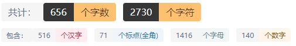

# 单调栈

## 前言

配套视频： [www.bilibili.com/video/BV1KX4y1w7um](https://www.bilibili.com/video/BV1KX4y1w7um)

## 一、单调栈简介
顾名思义，单调栈即满足单调性的栈结构。这里的单调递增或递减是指的从栈顶到栈底单调递增或递减。既然是栈，就满足后进先出的特点。与之相对应的是单调队列。

## 二、单调栈的实现

### 2.1插入

在当前元素插入栈里时和栈顶元素做对比，根据实际情况选择是否插入

### 2.2使用

我们可以记录单调栈实现过程中的一些中间值等等信息

### 2.3举例

现在有一组数10，3，7，4，12。从左到右依次入栈，则如果**栈为空**或**入栈元素值小于栈顶元素值**，则入栈；否则，如果入栈则会破坏栈的单调性，则需要把比入栈元素小的元素全部出栈。单调递减的栈反之。

① 10入栈时，栈为空，直接入栈，栈内元素为10。

② 3入栈时，栈顶元素10比3大，则入栈，栈内元素为10，3

③ 7入栈时，栈顶元素3比7小，则栈顶元素出栈，此时栈顶元素为10，比7大，则7入栈，栈内元素为10，7。

④ 4入栈时，栈顶元素7比4大，则入栈，栈内元素为10，7，4。

⑤ 12入栈时，栈顶元素4比12小，4出栈，此时栈顶元素为7，仍比12小，栈顶元素7继续出栈，此时栈顶元素为10，仍比12小，10出栈，此时栈为空，12入栈，栈内元素为12。

## 三、应用

### 3.1第一种应用

给一个数列，然后问你这个数列每一个元素右边(或者左边)第一个大于(或小于)该元素的位置

### 3.2第二种应用

给一个数列，寻找其中的一个子序列满足子序列的最小值和序列的长度的乘积最大

### 3.3第三种应用

给一个数列，寻找一个子序列的最小值和子序列的所有元素和的积最大


## 四、代码实现

以洛谷P5788为例

```cpp
#include<bits/stdc++.h>
using namespace std;

const int N = 3e6+10;
int a[N];
int f[N],n;
stack<int> S;

int main()
{
    scanf("%d",&n);
    for(int i = 1;i <= n; ++i) {
        scanf("%d",&a[i]);
    }

    for(int i = 1;i <= n; ++i) {
        while(S.size() && a[i] > a[S.top()]) {
            f[S.top()] = i;
            S.pop();
        }
        S.push(i);
    }
    for(int i = 1;i <= n; ++i) {
        printf("%d%c",f[i],i==n?'\n':' ');
    }
    return 0;
}
```


## 五、附上练习题

| 题目连接                                                     | 题目名                           |
| ------------------------------------------------------------ | -------------------------------- |
| [https://www.luogu.com.cn/problem/P5788](https://www.luogu.com.cn/problem/P5788) | P5788 【模板】单调栈             |
| [http://poj.org/problem?id=3250](http://poj.org/problem?id=3250) | Bad Hair Day                     |
| [http://acm.mangata.ltd/p/P1450](http://acm.mangata.ltd/p/P1450) | 第九集，离间计                   |
| [http://acm.mangata.ltd/p/P1443](http://acm.mangata.ltd/p/P1443) | Largest Rectangle in a Histogram |
| [http://poj.org/problem?id=3494](http://poj.org/problem?id=3494) | Largest Submatrix of All 1’s     |
| [http://poj.org/problem?id=2796](http://poj.org/problem?id=2796) | Feel Good                        |