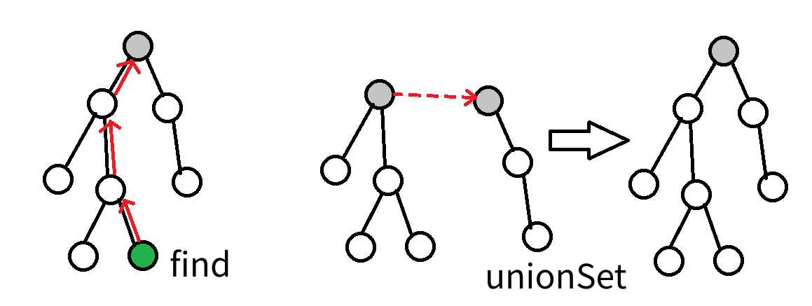
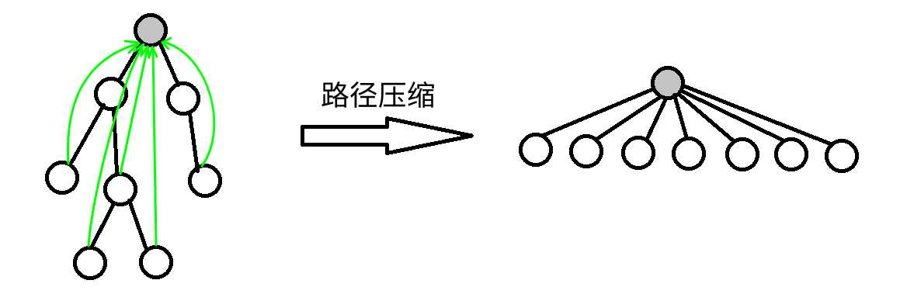

# 并查集

## 前言

配套视频

新版本：[www.bilibili.com/video/BV1w44y1j7R1](https://www.bilibili.com/video/BV1w44y1j7R1)

旧版本：[www.bilibili.com/video/BV1Uy4y1M7VM](https://www.bilibili.com/video/BV1Uy4y1M7VM)

## 一、并查集简介
并查集是一种树形的数据结构，顾名思义，它用于处理一些不交集的 **合并** 及 **查询** 问题。 它支持两种操作：

1.查找（find）：确定某个元素处于哪个子集

2.合并（merge）：将两个子集合并成一个集合

并查集能方便并有效的处理元素和元素之间的分类关系

## 二、初始化

```cpp
void init(int n) {
	for(int i = 1;i <= n; ++i) fa[i] = i;
}
```

先让每一个元素的父亲元素等于自己

## 三、查找

引用一个小故事：几个家族进行宴会，但是家族普遍长寿，所以人数众多。由于长时间的分离以及年龄的增长，这些人逐渐忘掉了自己的亲人，只记得自己的爸爸是谁了，而最长者（称为「祖先」）的父亲已经去世，他只知道自己是祖先。为了确定自己是哪个家族，他们想出了一个办法，只要问自己的爸爸是不是祖先，一层一层的向上问，直到问到祖先。如果要判断两人是否在同一家族，只要看两人的祖先是不是同一人就可以了。

这就是并查集的思想，我们只用记录当前元素的父元素是谁，每当需要判断是否一类时，通过寻找该元素的祖先元素即可区分

实现代码：

非递归式

```cpp
int find(int x) {
	whille(x != fa[x]) x = fa[x];
	return x;
}
```

递归式

```cpp
int find(int x) {
	if(x == fa[x]) return x;//如果x的父亲就是x那么就是找到了x的祖先节点
	return find(x);//递归返回
}
```

## 四、路径压缩

路径压缩的目的是为了提高查找效率，大家不难想到当这个并查集树退化成了一条链的时候，每次查询都需要遍历整个链，这样十分的费时间，所以我们可以通过路径压缩的方式对这个树形结构进行优化，也就是将每一个节点的父节点直接变成根节点也就是祖先节点。

偷两张图：





实现代码：

非递归实现：

```cpp
int find(int x) {
	int t = x;
	while(t != fa[t]) t = fa[t];//直接查找x的祖先节点
	while(x != fa[x]) {
		int temp = fa[x];
		fa[x] = t;//从下到上更新fa[x]的值为x的祖先节点的值
		x = temp;
	}
	return x;
}
```

递归实现：

```cpp
int find(int x) {
	if(x != fa[x]) fa[x] = find(x);//如果x不是自己的父亲节点那么就找到x的父亲节点，一路上路径压缩
	return fa[x];
}
```

## 五、合并

接着上面的故事，如果说有两个家族突然交好，他们的关系想合在一起，这个时候就需要进行合并操作，让一边的祖先变成另一个祖先的父节点即可

代码实现:

```cpp
void merge(int a,int b) {
	a = find(a);
	b = find(b);
	if(a != b) fa[b] = a;//如果两个元素不相等就让一个元素成为另一个元素的父节点
}
```

### 5.1按秩合并(了解)

按秩合并也成为启发式合并，其用途是用在两个集合的合并操作，当两个集合合并的时候，优先选择集合数少的元素融入集合元素多的里面，尽管无论哪种连接都能获取正确的答案，但是不同的连接方式可能会造成时间复杂度上面的差距，一般来说一颗小树连接到一颗大树上面会快一点。

当然，我们不总能遇到恰好如上所述的集合————点数与深度都更小。鉴于点数与深度这两个特征都很容易维护，我们常常从中择一，作为估价函数。而无论选择哪一个，时间复杂度都为 $O(mα(m,n))$ ，具体的证明可参见 $References$ 中引用的论文。

在算法竞赛的实际代码中，即便不使用启发式合并，代码也往往能够在规定时间内完成任务。在 Tarjan 的论文[1]中，证明了不使用启发式合并、只使用路径压缩的最坏时间复杂度是 $O(mlogn)$ 。在姚期智的论文[2]中，证明了不使用启发式合并、只使用路径压缩，在平均情况下，时间复杂度依然是 $O(mα(m,n))$ 。

如果只使用启发式合并，而不使用路径压缩，时间复杂度为 $O(mlogn)$ 。由于路径压缩单次合并可能造成大量修改，有时路径压缩并不适合使用。例如，在可持久化并查集、线段树分治 + 并查集中，一般使用只启发式合并的并查集。

## 六、并查集拓展

关于并查集的拓展嘴经典的还是属于**种类并查集**以及**带权并查集**

关于种类并查集也就是要维护多个关系的并查集，通常的并查集维护的是一个关系，也就是同一类集合的关系，但是种类并查集就可能维护两种、三种甚至更多的关系

种类并查集最经典的就是食物链和犯罪团伙

关于带权并查集就是要在记录节点的过程中每个节点会对应一个权值，我们在解题过程中需要对这个权值做一些处理然后来解决题目的问题

## 七、练习题目

| 题目连接                                                     | 题目名                                                       |
| ------------------------------------------------------------ | ------------------------------------------------------------ |
| [https://www.luogu.com.cn/problem/P1551](https://www.luogu.com.cn/problem/P1551) | P1551 亲戚                                                   |
| [https://www.luogu.com.cn/problem/P1536](https://www.luogu.com.cn/problem/P1536) | P1536 村村通                                                 |
| [https://www.luogu.com.cn/problem/P1525](https://www.luogu.com.cn/problem/P1525) | P1525 [NOIP2010 提高组] 关押罪犯（种类并查集）               |
| [https://www.luogu.com.cn/problem/P1621](https://www.luogu.com.cn/problem/P1621) | P1621 集合                                                   |
| [https://www.luogu.com.cn/problem/P1892](https://www.luogu.com.cn/problem/P1892) | P1892 [BOI2003]团伙                                          |
| [https://www.luogu.com.cn/problem/P1955](https://www.luogu.com.cn/problem/P1955) | P1955 [NOI2015] 程序自动分析(这个有趣)                       |
| [https://www.luogu.com.cn/problem/P2814](https://www.luogu.com.cn/problem/P2814) | P2814 家谱(这个简单，不过字符串处理一下)                     |
| [https://vjudge.net/contest/445444](https://vjudge.net/contest/445444) | 这个并查集题单还是挺有趣的                                   |
| [http://acm.hdu.edu.cn/showproblem.php?pid=3038](http://acm.hdu.edu.cn/showproblem.php?pid=3038) | How Many Answers Are Wrong（这是一个带权并查集，感兴趣的可以试试） |

这个题目人均7题吧