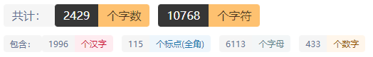

# STL和Algorithm

## 前言
配套视频：

蓝桥杯集训之Algorithm库函数: [https://www.bilibili.com/video/BV1ia411B7U2](https://www.bilibili.com/video/BV1ia411B7U2)

蓝桥杯集训之STL演示：[https://www.bilibili.com/video/BV1Z3411v72U](https://www.bilibili.com/video/BV1Z3411v72U)

蓝桥杯集训之Algorithm库函数：[https://www.bilibili.com/video/BV1Y34y1z7uX](https://www.bilibili.com/video/BV1Y34y1z7uX)
##  一、 STL部分

### 1.1 queue  （FIFO）

#### 1.1.1 头文件

使用该容器需要`#include<queue>`头文件

#### 1.1.2 定义

`queue<int> que;`//这个int可以更换成自己想要的数据

#### 1.1.3 基本操作

1.que.size()               返回队列元素数量

2.que.empty()            返回队列是否为空(空返回true,反之false)

3.que.push()              加入队列

4.que.pop()                出队

5.que.front()               返回队首

6.que.back()              返回队尾

#### 1.1.4 应用

队列广泛引用在广度优先搜索（BFS）里、约瑟夫环问题等

### 1.2 stack （FILO）

#### 1.2.1 头文件

使用该容器需要`#include<stack>`头文件

#### 1.2.2 定义 

`stack<int> S;`

#### 1.2.3 基本操作

1.`S.size()`                返回栈里元素个数

2.`S.empty()`             返回栈是否为空(空返回true,反之false)

3.`S.push()`              压入一个元素进栈

4.`S.pop()`                从栈弹出一个元素

5.`S.top()`                返回栈顶

#### 1.2.4 应用

逆波兰表达式等

### 1.3 priority_queue

#### 1.3.1 头文件

使用该容器需要`#include<priority_queue>`头文件

#### 1.3.2 定义

`priority_queue<int> que;`

默认大顶堆，通过添加`greater<int> `就能获得小顶堆

但是要注意这里如果想使用自定义的数据结构的话，需要手写排序规则：

eg：

```cpp
struct Node  //运算符重载
{
    int a,b;
    int val;
    bool friend operator <(node x,node y)//比较的是val
    {
        return x.val>y.val;
    }
};
priority_queue<Node> que;
```


#### 1.3.3 基本操作

1.que.size()               返回队列元素数量

2.que.empty()            返回队列是否为空(空返回true,反之false)

3.que.push()              加入队列

4.que.pop()                出队

5.que.top()               返回队首

#### 1.3.4 应用

应用在一些贪心的算法上面，优化dijkstra复杂度等


#### 1.3.5 重载代码

```cpp
pq.push(item):添加元素 O(logn)
pq.pop():使优先级最高的出队O(logn)
pq.top():获取优先级最高的元素O(1)
pq.size():获取元素个数O(1)
pq.empty():是否为空O(1)
优先队列的定义：
priority_queue<int> q1; //默认从大到小，大顶堆 
priority_queue<int ,vector<int>,less<int> > q2; //降序队列，大顶堆 
priority_queue<int ,vector<int>,greater<int> > q3; //升序队列，小顶堆
对于结构体定义：
struct T1{//法一 强烈推荐 
	int x,y;
	friend bool operator < (T1 a,T1 b){
		return a.x<b.x;
	}
};
priority_queue<T1> q1;

struct T1{//法二
	int x,y;
	bool operator < (const T1 &a) const{
		return x<a.x; //大顶堆 
	}
};
priority_queue<T1> q1; 
struct T2{int x,y;};//法三
bool operator <(T2 a,T2 b){
	return a.x>b.x;
}
priority_queue<T2> q2;

struct T3{int x,y;};//法四
struct tmp{ //重写仿函数 
	bool operator() (T3 a,T3 b){
		return a.x<b.x; //大顶堆 
	} 
};
priority_queue<T3, vector<T3>,tmp> q3
```


### 1.4 vector

#### 1.4.1 头文件

使用该容器需要`#include<vector>`头文件

#### 1.4.2 定义和特点

`vector<int> V;`

可以理解为变长数组，对元素的访问以及使用等非常方便，但是当元素存储过多会造成常数过大

#### 1.4.3 基本操作

1. `v.push_back(item):`	向v后加一个元素O(1)
2. `v.pop_back();`           删除v最后一个元素O(1)
3. `v.size();`                 获取v中元素个数O(1)
4. `v.resize(n);`             把v的长度重新设定为n个元素O(|n-size|)
5. `v.empty()`                  判断v是否为空O(1)
6. `v.clear();`                 清空v中的元素O(size)
7. `v[index];`                  获取v中下标为index的元素O(1)
8. `v.begin();`                 返回指向第一个元素的迭代器
9. `v.end();`                    返回指向vector末尾(最后一个元素之后的那个位置)的迭代器
10. `v.front();`                 返回第一个元素
11. `v.back();`                  返回最后一个元素
12. `v.erase(iterator loc);`  删除loc所指元素并返回下一元素迭代器
13. `v.erase(iterator start, iterator end);` 删除[start, end)之间的元素，并返回最后一个被删除元素的下个元素的迭代器
14. `vt.erase(unique(vt.begin(), vt.end()), vt.end());`   去重操作
15. `v.insert(v.begin()+4,3);` 在第五个元素前插入一个元素

#### 1.4.4 应用

应用十分广泛


### 1.5 set

#### 1.5.1 头文件

使用该容器需要`#incluide<set>`头文件

#### 1.5.2 定义

`set<int> S`

set就相当于是数学的集合，会对相同的元素进行去重处理并默认排序，和优先队列类似的，如果想自定义数据结构，那么需要写重载函数

#### 1.5.3 基本操作

1. `s.insert(item);`                                                 插入元素O(logn)
2. `s.size();`                                                         获取元素的个数O(1)
3. `s.empty();`                                                       判断是否为空O(1)
4. `s.clear();`                                                      清空s O(n)
5. `s.find(item);`                                                  在s中查找item并返回其iterator(迭代器)，找不到的话返回s.end()O(logn)
6. `s.count(item);`                                                返回s中item的数量，因为集合中的元素不能重复，因此只能返回0或1 O(logn)
7. `s.erase(it):`                                                  删除s中it指向位置的元素
8. `s.erase(item);`                                               删除s中值为item的元素
9. `s.earse(it1,it2);`                                           删除[it1,it2) 这个区间（迭代器）对应位置的元素
10. `iterator lower_bound( const key_type &key );` 返回一个迭代器，指向键值 >= key的第一个元素。
11. `iterator upper_bound( const key_type &key );` 返回一个迭代器，指向键值 > key的第一个元素。

#### 1.5.4 重载代码

```cpp
struct T1{
	int key,value;
	bool operator < (const T1 &a) const {
		return key<a.key;//按照升序排列 
	}
};

struct T2{
	int key,value;
};
struct T2cmp{
	bool operator () (const int &a,const int &b){
		if(abs(a-b)<=k)
			return false;
		return a<b;
	}
}; 

int main(){
	int i,j;
	set<T1> s1;
	set<T2,T2cmp> s2;
	set<string> ss1;//等于set<string,less<int> > ss1;从小到大
	set<string,greater<string> > ss2;//从大到小
	set<string,greater<string> > ::iterator itsey;
	//set的遍历
	set<string> :: iterator it; 
	for(it = ss1.begin();it!=ss1.end();it++){
		cout<<*it<<endl;
	}
	return 0;
}
```


### 1.6 unordered_set

这个其实就是不需要排序的set，就不用写重载函数了，其余操作和set相同

### 1.7 map

#### 1.5.1 头文件

使用该容器需要`#include<map>`头文件

#### 1.5.2 定义

`map<int,int> mp;`

注意的是map是一个键值对，是一个映射关系，你可以理解为帮你封装好了的hash表，通过键访问你的值

#### 1.5.3 基本操作

1. `mp.size();`获取元素个数O(1)
2. `mp.empty();`判断是否为空O(1)
3. `mp.clear();`清空mp O(1) 
4. `mp.find(key);`在map中查找key并返回其iterator,找不到的话返回mp.end() O(logn)
5. `mp.count(key);`在map中找key的数量，由于每个key都是唯一的，只会返回0或1
6. `mp[key]` 可以直接访问到键值队key---value中的value，如果不存在这样的键值对，那么mp[key]返回的是value类型默认构造器所构造的值，并将该键值对插入到map中
7. `mp[key]=tmp;`可以把键值对key---value中的value赋值为tmp,如果没有对应的键值对,则将该键值对插入到map中复杂度： O(logn)
8. `mp.insert(make_pair(key,value));`在mp中插入键值对key----value。一般不这样用，想要插入键值对的话直接使用mp[key]=value即可，map已经对[]运算符重载过了.

#### 1.5.4 应用

应用在一些需要键值对应的地方

### 1.8 unordered_map

#### 1.8.1 头文件

`#include<unordered_map>`

#### 1.8.2 和map区别

和上面类似，只不过内部变为无序，查找效率要稍微比map高一点点（内部是哈希表实现，而map是红黑树）


### 1.9 pair

#### 1.9.1 头文件

`#include <utility>`

#### 1.9.2 定义

`pair<int,int> P;`

可以理解为一个只有两个元素的结构体

#### 1.9.3 基本使用

1. `pair<T1, T2> p1; `//创建一个空的pair对象（使用默认构造），它的两个元素分别是T1和T2类型，采用值初始化。
2. `pair<T1, T2> p1(v1, v2);` //创建一个pair对象，它的两个元素分别是T1和T2类型，其中first成员初始化为v1，second成员初始化为v2。
3. `make_pair(v1, v2); `// 以v1和v2的值创建一个新的pair对象，其元素类型分别是v1和v2的类型。
4. `p1 < p2;` // 两个pair对象间的小于运算，其定义遵循字典次序：如 p1.first < p2.first 或者 !(p2.first < p1.first) && (p1.second < p2.second) 则返回true。
5. `p1 == p2`// 如果两个对象的first和second依次相等，则这两个对象相等；该运算使用元素的==操作符。
6. `p1.first;` // 返回对象p1中名为first的公有数据成员。
7. `p1.second;` // 返回对象p1中名为second的公有数据成员。

#### 1.9.4 应用场景

应用到坐标点的表示等


### 1.10迭代器`iterator`

#### 1.10.1定义方法

`容器类名::iterator 迭代器名;`

#### 1.10.2 使用

可以看作一个指针，支持自增和自减，但是不支持多位移动

#### 1.10.3 详细学习资料

[http://c.biancheng.net/view/338.html](http://c.biancheng.net/view/338.html)


### 1.10 string


## 二、Algorithm部分

### 2.1 sort

排序函数，这里如果想定制化的话则需要手写cmp函数，和我们上面看的重载比较函数类似：

学习连接：[https://blog.csdn.net/m0_46201544/article/details/116321894](https://blog.csdn.net/m0_46201544/article/details/116321894)


### 2.2 __gcd

求解最大公因数的内置函数：`int c = __gcd(a,b);`

### 2.3 max

参数是两个相同类型的数，然后返回一个最大值

### 2.4 min

参数是两个相同类型的数，然后返回一个最小值

### 2.5 abs

返回该数的绝对值

### 2.6 swap

交换两数

### 2.7 reverse

反转容器或者数组，容器的话需要添加迭代器，数组直接放地址

eg:

```cpp
vector<int> V;
V.push_back(1);
V.push_back(2);
int a[3]={0,1,2};
reverse(a,a+3);
for(int i = 0;i < 3; ++i) printf("%d\n",a[i]);
reverse(V.begin(),V.end())
```

### 2.8 next_permutation

这个是一个全排列函数：

```cpp
do{
    xxx
}while(next_permutation(a,a+n));
```


### 2.9 lower_bound

`lower_bound`(起始地址，结束地址，要查找的数值) 返回的是>=x的第一个数的地址。

在从小到大的排序数组中：

- `lower_bound( begin,end,num)`：从数组的begin位置到end-1位置二分查找第一个大于或等于num的数字，找到返回该数字的地址，不存在则返回end。通过返回的地址减去起始地址begin,得到找到数字在数组中的下标。
- `lower_bound( begin,end,num,greater())`:从数组的begin位置到end-1位置二分查找第一个小于或等于num的数字，找到返回该数字的地址，不存在则返回end。通过返回的地址减去起始地址begin,得到找到数字在数组中的下标。

### 2.10 upper_bound

`upper_bound`(起始地址，结束地址，要查找的数值) 返回的是>x的第一个数的地址

在从小到大的排序数组中：

- `upper_bound( begin,end,num)`：从数组的begin位置到end-1位置二分查找第一个大于num的数字，找到返回该数字的地址，不存在则返回end。通过返回的地址减去起始地址begin,得到找到数字在数组中的下标。
  在从大到小的排序数组中，重载`lower_bound()`和`upper_bound()
- `upper_bound( begin,end,num,greater())`:从数组的begin位置到end-1位置二分查找第一个小于num的数字，找到返回该数字的地址，不存在则返回end。通过返回的地址减去起始地址begin,得到找到数字在数组中的下标

注意一点这个`lower_bound`和`upper_bound`只能用于非降序列，如果要用于非升序列的那要加一个`greater <int> () `


## 三、训练题单

[http://acm.mangata.ltd/training/61cff0d9aa36161f3c11f143](http://acm.mangata.ltd/training/61cff0d9aa36161f3c11f143)

目前有大约30题