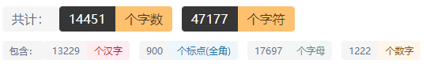

# 0基础速通C语言
配套视频：[https://www.bilibili.com/video/BV1W34y1U7eK?spm_id_from=333.999.0.0](https://www.bilibili.com/video/BV1W34y1U7eK?spm_id_from=333.999.0.0)

## 一、关于C语言

C 语言是一种通用的高级语言，最初是由丹尼斯·里奇在贝尔实验室为开发 UNIX 操作系统而设计的。C 语言最开始是于 1972 年在 DEC PDP-11 计算机上被首次实现。

在 1978 年，布莱恩·柯林汉（Brian Kernighan）和丹尼斯·里奇（Dennis Ritchie）制作了 C 的第一个公开可用的描述，现在被称为 K&R 标准。

UNIX 操作系统，C编译器，和几乎所有的 UNIX 应用程序都是用 C 语言编写的。由于各种原因，C 语言现在已经成为一种广泛使用的专业语言。

### 1.1 优点

- 易于学习。
- 结构化语言。
- 它产生高效率的程序。
- 它可以处理底层的活动。
- 它可以在多种计算机平台上编译。

### 1.2 缺点

- 因为C语言给编写者太大权限，你可能把握不住

## 二、为什么要学习C语言

C 语言最初是用于系统开发工作，特别是组成操作系统的程序。由于 C 语言所产生的代码运行速度与汇编语言编写的代码运行速度几乎一样，所以采用 C 语言作为系统开发语言。并且C语言便于理解，也是很多其他语言的母语言，通过学习C语言，我们能够快速的对编程进行一个了解，并且后续在学习其他语言的时候(语法)会更加容易，所以C语言的学习是有必要的

## 三、C语言的IDE

### 3.1 关于IDE：

IDE就是一系列开发工具的组合套装.这就好比台式机，一个台式机的核心部件是主机，有了主机就能独立工作了，但是我们在购买台式机时，往往还要附带上显示器、键盘、鼠标、U盘、摄像头等外围设备，因为只有主机太不方便了，必须有外设才能玩的爽。

集成开发环境也是这个道理，只有编译器不方便，所以还要增加其他的辅助工具。在实际开发中，我一般也是使用集成开发环境，而不是单独地使用编译器。

#### 3.1.1 通俗的称呼

有时候为了称呼方便，或者初学者没有严格区分概念，也会将C语言集成开发环境称作“C语言编译器”或者“C语言编程软件”。这里大家不要认为是一种错误，就把它当做“乡间俗语”吧。

(本教程建立在Windows平台)

初学者的话使用IDE我推荐 [Devcpp](https://bloodshed-dev-c.en.softonic.com/)，这个IDE非常轻便好用

如果你想有一个好看的编辑界面，那么我建议你用[VScode](https://code.visualstudio.com/) 或者[Visual Studio](https://visualstudio.microsoft.com/zh-hans/vs/)

当然我还是推荐使用[CLion](https://www.jetbrains.com/zh-cn/)

## 四、程序结构

一个C程序包含以下部分

- 预处理指令
- 函数
- 变量
- 逻辑代码
- 注释

举个栗子：

```cpp
#include<stdio.h>
//上面是头文件，下面是函数
int main()
{
	printf("Hello Mangata!");
    return 0;
}
```


我们先来剖析一下这个C程序

第一行就是一个预处理指令，也就是我们后面讲的头文件

第二行就是一个行注释，当然我们也可以通过`/* */` 来达到区间块注释的效果

第三行开始到第七行就是一个标准的函数，也就是我们后面讲的主函数，要记住一个C程序一定有且只有一个main函数

第五行是一个输出语句，调用了`printf`库函数

 

## 五、基本语法

### 5.1 头文件

#### 5.1.1 为什么要用头文件呢

因为头文件里面有我们需要的一些基本函数，比如输入的`scanf`输出的`printf`，这些函数前人们已经帮我们写好了，不必我们从头开始，所以我们需要引入头文件来使用库函数，可以方便我们的程序编写

#### 5.1.2 怎么引入呢

我们通过`#include`的一种“指令” ，头文件的引入是预处理语句

`#include`叫做文件包含命令，用来引入对应的头文件（`.h`文件）。#include 也是C语言预处理命令的一种。

#### 5.1.3 include格式

```cpp
#include <xxx.h>
#include "xxx.h"
```

这就是C语言的两种引入头文件的格式，中间的空格不是必须的(😀)，xxx就是你想用的库

#### 5.1.4 常用的头文件

| 头文件               | 描述                         |
| -------------------- | ---------------------------- |
| `#include<stdio.h>`  | 这是一个标准输入输出的头文件 |
| `#include<math.h>`   | 这是数学函数的头文件         |
| `#include<string.h>` | 这是字符串函数的头文件       |
| `#include<time.h>`   | 这是时间函数的头文件         |
| `#include<stdlib.h>` | 实用工具函数的头文件         |

这些大概就是平常使用较多的头文件了，关于头文件具体的哪些函数，我后面会讲一些，但是也只是常用的，所以更多的东西还需要同学们自己去网上拓展

我这里放一个这些头文件的常用函数连接：[https://blog.csdn.net/acm_Mercyking/article/details/50119289](https://blog.csdn.net/acm_Mercyking/article/details/50119289)感兴趣的同学可以去自己拓展一下噢

### 5.2 标准输入输出函数

#### 5.2.1 scanf

这个是标准输入函数，因为输入对格式要求很严，不过速度是非常快的，下面是`scanf`的声明

```cpp
int scanf(const char *format, ...)
```

`scanf`前面那个int是返回类型，可以不用管，如果你真想知道的话，其实也很简单，就是成功输入赋值的个数

关于括号里面，自然就是传的参数咯，我们一一来看括号里面的东西，里面的结构是长下面这样的：

```cpp
scanf("<格式化字符串>", <参量表>);
scanf("%d",&a);
```

这里的例子我们用的是一个%d，这是什么意思呢？这就表示我们输入的数据的类型是一个int整形的，除了`%d`我们还有`%c`、`%lf`、`%lld`等等一系列的标准化输入的格式，具体哪种类型使用哪种符号，那就要根据使用情况看啦，也就是下面我们提到的数据类型。

#### 5.2.2 printf

标准输出其实道理和标准输入是同理的，我们先来看看这个标注输出声明

```cpp
int printf(const char *format, ...)
```

同理函数前面有一个int的返回值，如果函数成功执行，那么就会返回输出的字符数，否则就会返回一个负数

我们再来看这个`printf`的一个结构

```cpp
printf("<格式化字符串>", <参量表>);
printf("%d\n",a);
```

其实和`scanf`标准输入的结构是大同小异的，`" "` 中间放的就是格式字符形式，参量表就是你想输出的变量，可以是一个也可以是多个，也可以没有，我们直接输出字符类型的东西就不需要变量，但是请注意存在转义的情况，比如`'\'`，感兴趣的同学可以去百度一下

### 5.3 关于'格式化'

为什么我要单独写一个关于格式化的单点呢，因为这才是格式化输入输出的一个**特点**或者说是小技巧

我们来看`scanf`这个标准输入，在括号里面的双引号里面的是我们格式化输入的东西，我举个栗子：

如果有一个题目是这样的，要求你输入一个 Mangata+(数字)，然后把数字输出出来，如果学过字符串处理的同学，应该就会觉得那直接一个正则，或者把Mangata去掉，然后输出

这样都可以，甚至来说第二种更加好，但是如果这个数字不大，并且要求你对这个数字做一些计算上的操作呢？这里我们就能用到`scanf`的格式化输入了：

```cpp
#include<stdio.h>
int main() {
    int a;
	scanf("Mangata%d",&a);
    printf("%d\n",a);
    return 0;
}
```

再比如说如果我们需要输出一个时间例如这样08:01，有这种前置零，通过字符串的输出要麻烦得多，我们可以直接通过格式化输出:

```cpp
#include<stdio.h>
int main() {
    printf("%02d:%02d",8,1);
    return 0;
}
```

由于本书只是速通教程，所以我不在做过多的列举，更多的东西还是要靠同学们自己学习啦

### 5.4 数据类型

#### 5.4.1 整数类型

| 类型                     | 存储大小    | 值的范围                                     |
| ------------------------ | ----------- | -------------------------------------------- |
| `char`(默认就是`signed`) | 1字节       | -128~127或者0 ~ 255                          |
| `unsigned char`          | 1 字节      | 0 ~ 255                                      |
| `signed char`            | 1 字节      | -128~127                                     |
| `int`                    | 2 或 4 字节 | -32768 到 32767 或 -2147483648 到 2147483647 |
| `unsigned int`           | 2 或 4 字节 | 0 ~ 65535 或 0 ~ 4294967295                  |
| `short`                  | 2 字节      | -32768 ~ 32767                               |
| `unsigned short`         | 2 字节      | 0 ~ 65535                                    |
| `long`                   | 4 字节      | -2147483648 ~ 2147483647                     |
| `unsigned long`          | 4 字节      | 0 ~ 4294967295                               |
| `long long`              | 8字节       | -9223372036854775808~9223372036854775807     |

#### 5.4.2 浮点类型

| 类型          | 存储大小 | 值范围                | 精度        |
| ------------- | -------- | --------------------- | ----------- |
| `float`       | 4 字节   | 1.2E-38 ~ 3.4E+38     | 6 位有效位  |
| `double`      | 8 字节   | 2.3E-308 ~ 1.7E+308   | 15 位有效位 |
| `long double` | 16 字节  | 3.4E-4932 ~ 1.1E+4932 | 19 位有效位 |

我们可以通过一个**关键字**`sizeof`来获得一个类型或者说后面的变量等等的大小

举个栗子:

```cpp
#include<stdio.h>
int main()
{
	printf("%d\n",sizeof(char));
	printf("%d\n",sizeof(int));
	printf("%d\n",sizeof(long));
	printf("%d\n",sizeof(double));
	return 0;
}
/*
输出结果
1
4
4
8
*/
```

这里我们使用了`printf`库函数和`sizeof` **关键字** ，前者是打印函数，后者是计算对象内存大小的关键字 

我这里列举一下常用的几个格式化符号：

| 类型        | 输入格式化 | 输出格式化     |
| ----------- | ---------- | -------------- |
| `int`       | `%d`       | `%d`           |
| `char`      | `%c`       | `%c`           |
| `float`     | `%f`       | `%f`           |
| `double`    | `%lf`      | `%lf` 或者`%f` |
| `long long` | `%lld`     | `%lld`         |
| 字符串      | `%s`       | `%s`           |

#### 5.4.3 void 类型

- void类型可以拿来修饰函数，函数也就不需要一个返回值，我们之后在讲
- void类型可以拿来修饰指针，这种指针我们可以通过强制转换来实现转换到任意数据类型

我这里放一张C语言包含的数据类型的图，便于大家理解记忆:


关于其他没讲的类型在下面我会一一讲解的，不用担心啦！

### 5.5 变量

#### 5.5.1 命名规则

1. 变量名的开头必须是字母或下划线，不能是数字。实际编程中最常用的是以字母开头，而以下划线开头的变量名是系统专用的。
2. 变量名中的字母是区分大小写的。比如 a 和 A 是不同的变量名，num 和 Num 也是不同的变量名。
3. 变量名绝对不可以是C语言关键字，这一点一定要记住！(关于关键字可以看下面的关键字表格，记住常用的就行了)
4. 变量名中不能有空格。这个可以这样理解：因为上面我们说过，变量名是字母、数字、下划线的组合，没有空格这一项。

关于编程命名规范您可以参考这个博客:[https://www.cnblogs.com/wfwenchao/p/5209197.html ](https://www.cnblogs.com/wfwenchao/p/5209197.html) 当然你也可以用~~拼音~~ 

举个例子: 

```cpp
int temp;//定义了一个int数据类型的变量，名叫temp
char str;//定义了一个char数据类型的数据变量，名叫str
double num;//定义了一个double数据类型的数据变量，名叫num
```

变量定义就是告诉编译器在何处创建变量的存储，以及如何创建变量的存储。变量定义指定一个数据类型，并包含了该类型的一个或多个变量的列表

比如你要定义四个变量，这四个变量都是int类型的，你就可以将他们写在一起，他们之间用,隔开末尾以;结束

```cpp
int a,b,c,d;
int e = 10;
```

上述的例子都是定义，那么什么是声明呢？，我们来看两个例子

1. 使用关键字修饰

   ```cpp
   extern int a;//表示的其他文件以及定义过a这个变量，我们这里直接拿来使用
   ```

2. 函数声明

   ```cpp
   void f(int a);//没有返回类型的函数声明
   ```

声明和定义最重要的区别就是：**定义创建了对象并为此对象分配了内存，而声明并未分配内存**

### 5.6 强制转换

这个东西不难，讲起来也很简单，但是还算比较重要所以单独讲一下：

其实在程序中字节长度较高的变量对字节长度较低的变量有**一定**的兼容性的，但是低的对高的可不是了，因为很可能造成数据的溢出，或者是不同数据类型之间float和int，我们得到的是一个float值，但是我们想保存一个int值，那么这个时候就需要用到**强制转换**，我举个栗子：

```c
#include <stdio.h>

int main ()
{
    float a = 1.234;
    int b = (int)a;
    printf("a = %f\tb = %d\n",a,b);
    return 0;
}
```

这个栗子很简单，我们下面到内存控制的时候使用`malloc`也是需要强制转换的。

### 5.7 左值右值

1. **左值（`lvalue`）：**指向内存位置的表达式被称为左值（`lvalue`）表达式。左值可以出现在赋值号的左边或右边。

2. **右值（`rvalue`）：**术语右值（`rvalue`）指的是存储在内存中某些地址的数值。右值是不能对其进行赋值的表达式，也就是说，右值可以出现在赋值号的右边，但不能出现在赋值号的左边。

   	变量是左值，因此可以出现在赋值号的左边。数值型的字面值是右值，因此不能被赋值，不能出现在赋值号的左边。

举个栗子：

```cpp
int a = 20;
```

在这个语句中a就是一个指向内存的变量也就是左值，20就是存储在内存某个地址的数值，有了这个概念就能理解下面的这个语句了

```cpp
int a = 0;
a = a + 1;
printf("%d\n",a);
```

		这里我们声明了一个`int`类型的变量a，然后在声明的时候给它定义了初值为0，然后第二个语句我们让`a = a + 1`，注意此时左边的a是一个变量，也就是上面我们说的左值，右边是a的值加上1，也就是右边的整体构成了一个右值，其实对于左值右值不必纠结太多，这个语句实现的效果就是a自增1，也就是说如果我们运行上面的代码的话会给我们打印一个1，这个1就是通过运算后a的值


### 5.8 常量

####  5.8.1 数值常量

注意此数值常量非彼数值，我此处所说的常量是单纯的一个值，没有名字那种，比如 3 他是一个整形常量 0.3 是一个浮点常量再比如说 `'c'` 它是一个字符常量 `"ccc"` 它是一个字符串常量，这种就是**数值常量**了，一般只是用来初始化，而且这种数值常量不易维护，比如说我们在一个程序的很多地方都用了同一个常量那么如果你想修改这个常量的值，稍微笨点的同学可能会一个一个的替换，有的同学可能想到了直接文件全局替换，但是这样做是有风险的，比如我的常量为1，我想把它替换为2，但是我可能有一些其他的常量是1开头的，比如12，那么就会造成数据紊乱，甚至有些变量里面也包含了1那么可能会导致编译出错，再退一步讲，编译没问题，程序的运行结果也不会和预期一样

#### 5.8.2 define常量

说的浅显易懂点，define就是一个文本替换，格式如下

```cpp
#define xxx yyy //达到的效果就是下面的程序所有用到的xxx都会被替换为yyy
#define x 10//这里就表示x是一个常量，它表示的value是10
```

- 当然你也可以通过#define 来实现宏函数eg:

```cpp
#define max(a,b) (a>b?a:b)
```

- `#define` 是一个预处理指令，所以在书写代码的时候请将`#define`放在程序的顶部
- `#define`后面没有**分号** !
- 请尽量少使用`#define`，因为`#define`相当于一种文本替换，在代码行数较少发生的问题较少，但是在代码量较大的时候这种常量就会存在一种潜在的危险->冲突(如果报错还好，没有报错那就难受了，大概率程序的运行结果和预期不同)

#### 5.8.3 const关键字

const是constant的缩写，是一个修饰词用于修饰一些变量，通过const修饰符的变量就变成了一个**不可变的变量**

eg:

```cpp
const int a = 10;//这就是定义了一个常量，名叫a，值为10
```

- 通过`const`修饰后不能更改值
- 我们可以通过指针修改`const`定义的常量

#### 5.8.4 通过const修改指针

大体上分为三类

- 一、`const`修饰指针指向的内容，则内容不可变，但是能通过一个同数据类型的指针来改变值

```cpp
const int *a = 10;// 这样的内容不可变
```

- 二、`const`修饰指针，那么指针的值不可变

```cpp
int a = 10;
int* const b = &a;
```

此时的`const`修饰的是指针，那么指针指向的地址不可变，也就是此时的b指向的地址不能边变，但是*b可变，请同学们要想明白

- 三、`const`修饰指针并且修饰的指针指向的内容，那么指针指向的地址和值都不可变

```cpp
int a = 10;
const int * const b = &a;
```

此时的b指向的地址不能更改，地址上的值*b也不能更改

### 5.9 存储类

#### 5.9.1 auto

auto是一种默认的存储类，作用范围是局部，一般不用管，生命周期和作用域都是局部的

#### 5.9.2 static

这是一个静态的存储类，它有点特殊的是他的生命周期是整个程序从开始到结束，但是它的作用域只是局部

举个栗子:

```cpp
#include<stdio.h>
void f() {
    static int a = 0;
    a++;
    printf("%d\n",a);
}
int main()
{
    for(int i = 0;i < 5; ++i) {
        f();
    }
  	return 0;
}
```

你觉得会输出什么呢？对没错，输出

```cpp
1
2
3
4
5    
```

换句话说我们在函数里面定义的是一个静态变量，它的声明周期就是从定义它到程序结束，所以这里输出的内容也就不难理解了

#### 5.9.3 register

**register** 存储类用于定义存储在寄存器中而不是 RAM 中的局部变量。这意味着变量的最大尺寸等于寄存器的大小（通常是一个词），且不能对它应用一元的 '&' 运算符（因为它没有内存位置）。

再来用一个通俗的解释：


此段出自**《C语言深度剖析》**，很棒的一本书，建议有一定基础再看

#### 5.9.4 extern 

**extern** 存储类用于提供一个全局变量的引用，全局变量对所有的程序文件都是可见的。当您使用 **extern** 时，对于无法初始化的变量，会把变量名指向一个之前定义过的存储位置。

当您有多个文件且定义了一个可以在其他文件中使用的全局变量或函数时，可以在其他文件中使用 *extern* 来得到已定义的变量或函数的引用。可以这么理解，*extern* 是用来在另一个文件中声明一个全局变量或函数。

总结一句话extern就是为了在多文件编程的时候直接取另外一个文件的变量

关于extern，其实初学者不必过于关系，后面做项目开发的时候查找查找用法即可，我们这里也就不过多展开了

### 5.10 运算符

#### 5.10.1 算数运算

| 运算符 | 效果             | 例子                  |
| ------ | ---------------- | --------------------- |
| `+`    | 对两个数进行相加 | a = 1 + 2  => a= 3    |
| `-`    | 对两个数进行相减 | a = 2 - 1 => a = 1    |
| `*`    | 对两个数进行相乘 | a = 2 * 2 => a = 4    |
| `/`    | 对两个数进行相除 | a = 10 / 2 => a = 5   |
| `%`    | a对b取模         | a = 10 % 3 = > a = 1  |
| `++`   | 变量自增1        | a = 0; ++a => a = 1   |
| `--`   | 变量自减1        | a = 0 ; --a => a = -1 |

#### 5.10.2 关系运算

| 运算符 | 描述                                                         | 实例            |
| :----- | :----------------------------------------------------------- | :-------------- |
| `==`   | 检查两个操作数的值是否相等，如果相等则条件为真。             | (A == B) 为假。 |
| `!=`   | 检查两个操作数的值是否相等，如果不相等则条件为真。           | (A != B) 为真。 |
| `>`    | 检查左操作数的值是否大于右操作数的值，如果是则条件为真。     | (A > B) 为假。  |
| `<`    | 检查左操作数的值是否小于右操作数的值，如果是则条件为真。     | (A < B) 为真。  |
| `>=`   | 检查左操作数的值是否大于或等于右操作数的值，如果是则条件为真。 | (A >= B) 为假。 |
| `<=`   | 检查左操作数的值是否小于或等于右操作数的值，如果是则条件为真。 | (A <= B) 为真。 |

#### 5.10.3 逻辑运算

| 运算符 | 描述                                                         | 实例              |
| :----- | :----------------------------------------------------------- | :---------------- |
| `&&`   | 称为逻辑与运算符。如果两个操作数都非零，则条件为真。         | (A && B) 为假。   |
| `||`   | 称为逻辑或运算符。如果两个操作数中有任意一个非零，则条件为真。 | (A \|\| B) 为真。 |
| `!`    | 称为逻辑非运算符。用来逆转操作数的逻辑状态。如果条件为真则逻辑非运算符将使其为假。 | !(A && B) 为真。  |

#### 5.10.4 位运算

以下的运算都是将数转化为二进制在进行运算，然后再转化为相应的进制

| 运算符 | 描述                                | 实例      |
| ------ | ----------------------------------- | --------- |
| `&`    | 与运算     全一则一，否则为零       | 3 & 6 = 2 |
| `|`    | 或运算     有一则一，否则为零       | 3 & 6 = 7 |
| `^`    | 异或运算  不同为一，相同为零        | 3 ^ 4 = 7 |
| `~`    | 取反运算   零一颠倒                 | ~4 = 3    |
| `<<`   | 左移运算    效果等价十进制中乘$2^n$ | 5<<1 = 10 |
| `>>`   | 右移运算    效果等价十进制中除$2^n$ | 5>>1 = 2  |


#### 5.10.5 其他

| 运算符     | 描述             | 实例                                 |
| :--------- | :--------------- | :----------------------------------- |
| `sizeof()` | 返回变量的大小。 | `sizeof(a)`将返回 4，其中 a 是整数。 |
| `&`        | 返回变量的地址。 | &a; 将给出变量的实际地址。           |
| `*`        | 指向一个变量。   | *a; 将指向一个变量。                 |
| `? :`      | 条件表达式       | 如果条件为真 ? 则值为 X : 否则值为 Y |

#### 5.10.6 运算符优先级表格

| 类别       | 运算符                              | 结合性   |
| :--------- | :---------------------------------- | :------- |
| 后缀       | `() [] -> . ++ - -`                 | 从左到右 |
| 一元       | `+ - ! ~ ++ - - (type)* & sizeof`   | 从右到左 |
| 乘除       | `* / %`                             | 从左到右 |
| 加减       | `+ -`                               | 从左到右 |
| 移位       | `<< >>`                             | 从左到右 |
| 关系       | `< <= > >=`                         | 从左到右 |
| 相等       | `== !=`                             | 从左到右 |
| 位与 AND   | `&`                                 | 从左到右 |
| 位异或 XOR | `^`                                 | 从左到右 |
| 位或 OR    | `|`                                 | 从左到右 |
| 逻辑与 AND | `&&`                                | 从左到右 |
| 逻辑或 OR  | `||`                                | 从左到右 |
| 条件       | `?:`                                | 从右到左 |
| 赋值       | `= += -= *= /= %=>>= <<= &= ^= \|=` | 从右到左 |
| 逗号       | `,`                                 | 从左到右 |


### 5.11 条件判断

#### 5.11.1 if判断

```cpp
#include<stdio.h>
int main()
{
    if(a > 10) { // 这里就是一个if判断
        printf("YES");
    }
    else  {
        printf("NO");
    }
    return 0;
}

```

if判断很简单，逻辑值为真那么就执行if下方的语句，（**但是注意如果没有大括号的话那么只执行下面一行的内容**），我们通过else就可以处理逻辑为假的情况，那么如果我们要判断很多种情况呢，这时我们就可以使用一下结构

```cpp
if(xxx) {
    
}
else if(xxx) {
    
}
else {
    
}
```

注意上面的代码，这里我们能发现多了个`else if` 的判断，聪明的你们应该猜到了，这个`else if`就是为了在判断的情况不止两种的时候使用的，当然你只用`if …… else `的结构能不能实现呢？按理来说是能的，不过这样的逻辑结构设计的就会稍稍有一点复杂或者说是繁琐。

#### 5.11.2 三目运算符

```cpp
action ? ans1:ans2;
```

大家不要觉得这个很难，其实就是一个简化的 

```cpp
if(action) {
    ans1;
}
else {
    ans2;
}
```

action表示的是逻辑判断的值，ans1就表示判断为真所做的操作，ans2就表示判断为假所作的操作

### 5.12 循环

在讲下面几个循环的方式之前，我先来说说什么是循环，**循环就是多次执行同一个流程**，为什么是流程呢，因为可能每次操作得到的值不一样，或者说里面有一些嵌套判断什么的，最终每次的操作可能不太一样，比如说我有一个循环，我外面定义了一个变量他的初始值是1，我在循环里面做一件事情如果这个数是奇数那么我就让它加一，否则，让它不变，我们将这个循环四次，最终这个变量的结果就是2，我们可以先看看这个代码的for格式

```cpp
#include<stdio.h>
int main()
{
	int a = 1;
    for(int i = 0;i < 4; ++i) {
        if(a % 2 == 1) a++;
        else a = a; //注意这里的else其实是可以删掉的
    }
    printf("%d\n",a);
	return 0;
}
```

#### 5.12.1 for循环

for循环由四部分组成，**初始化**，**条件判断**，**迭代更新**，**逻辑操作语句**

我们先来看一下for的结构

```cpp
for(初始化语句;条件判断;迭代更新) {
    逻辑操作语句
}
//eg：
for(int i = 0;i < 10; ++i) {
    //pass
}
```

注意这里的初始化、迭代更新、逻辑操作都可以省略，直接不写即可，但是条件判断一定要写上，并且两个`;`不能省略

#### 5.12.2 while循环

while循环看起来就要简单一点(结构上)，只有**条件判断**和**逻辑操作**

我们来看while的结构

```cpp
while(条件判断) {
	逻辑操作语句
}
//eg：
int i = 0;
while(++i < 10) {
    //pass
}
```

当条件不满足的时候就会跳出循环，也就是条件判断为真就继续循环，条件判断为假就跳出循环

#### 5.12.3 do……while循环

`do……while`在结构上也只有**条件判断**和**逻辑操作**

我们来看`do……while`结构

```cpp
do{
    逻辑操作语句
}while(条件判断)
```

`do……while`和`while`的区别就在于`while`第一次判断如果不满足那么就不进入循环，而**`do……while`会先进行一次操作**，然后再判断是否继续循环

举个栗子：

当你在一个文件中读取数据的时候，什么时候才算读完了呢？一般的话文件会有一个结束符（EOF），那么我们使用`do……while`结构，先读，读完后判断是否是文件结束符，如果不是的话那么就继续循环。

#### 5.12.4 循环控制

- 嵌套循环

我们上面的循环都只是一层循环，假如一层循环是遍历一行数据，那么如果我们想遍历一个$n\times n$的矩阵，那么我们就可以通过二层循环来实现，例如

```cpp
#include<stdio.h>
int main()
{
    int n;
	for(int i = 0;i < n; ++i) {
        for(int j = 0;j < n; ++i) {
            //op
        }
    }
	return 0;
}
```

这就是一个简单的二层循环

- 死循环

当我们的条件判断设计不合理或者说在for循环中没有设置判断条件，那么就会导致死循环，有的时候我们需要死循环，有的时候我们不需要，所以是否需要要根据你的需求来看，举个简单的栗子，这个操作系统就可以简单的看成一个死循环，但是在**大部分情况下**我们应该是要**避免出现死循环**的，出现了死循环一定要好好检查循环处的代码

- break 和 continue

两者都是跳过循环，但是`break`是跳过整个剩下的循环，而`continue`只是跳过当前这次循环，也就是说后面如果还有循环操作，那么就继续执行

- goto

`goto`语句在很多课程或者是一些学习的资料里面都很少，很多程序员也觉得这个是个辣鸡玩意，但是我觉得`goto`只要用对了地方，那么就是一个非常有用的工具，使用`goto`的时候请务必不要向上跳，如果你把握不住的话那么你就不要使用这个语句，在我看来`goto`一般使用在多重循环里面想直接跳出多重循环，而不是写多个break。

eg:

```cpp
#include<stdio.h>
int main()
{
	for(int i = 0;i < 10; ++i) {
        for(int j = 0;j < 10; ++j) {
            for(int k = 0;k < 10; ++k) {
                if(i + j + k == 12) {
                    goto out;//我们找到我们想要的第一个答案就直接goto跳出三层循环，这个out只是一个代名词，随意更改，不过要和下面对应上
                }
            }
        }
    }
    out://跳出的地方
        printf("YES");
	return 0;
}
```

关于循环我们就讲到这里

### 5.13 数组

数组就是存储一个固定大小的相同类型元素的顺序集合，注意这个集合里面的元素的类型都是一样的，我们可以通过**数组名+下标**的方式来访问我们存储的数据

- 数字的下标是从0开始计数到n-1结束的
- 数组的元素都是相等的类型
- 数组可以不止一维
- 数组的长度是固定的

#### 5.13.1 声明

数据类型 + 数组名 + 数组大小

eg:

```cpp
int a[10];
```

这里我们就声明了一个10个int数据大小的数组，假设一个`int`占4个字节，那么这个数组就要占40个字节，其他类型比如`char`、`double`或者是结构体类型都可以这样声明

#### 5.13.2 初始化

- 我们可以在声明的时候就初始化

eg:

```cpp
int a[3]={0,1,2};
int b[3]={0};
```

这里我们就将a数组的三个位置初始化为0、1、2了，b数组这样做可以全部初始化为0，当然你如果是定义了的是全局数组那么它会自动给你初始化为0，但是局部的话，你不初始化那么就可能会给你一些随机值。

- 我们也可以在声明后初始化

①memset()函数初始化

我们先来看看这个函数的声明：

```cpp
void *memset(void *str, int c, size_t n)
```

第一个传的参数是一个`void`类型指针，也就是任何数据类型都可以，第二个是`int`类型的，也就是初始化的值，第三个参数是长度，也就是要初始化的字节数，我举个栗子

eg:

```cpp
#include<stdio.h>
#include<string.h>
int a[10];
int main()
{
	memset(a,-1,sizeof a);
    printf("%d\n",a[0]);
    printf("%d\n",-1);
	return 0;
}
```

②循环初始化

还记得我们上面讲的循环吗，这里就派上用场了，我们可以通过循环来一个一个遍历这个数组，然后手动给它赋值

eg:

```cpp
#include<stdio.h>
#include<string.h>
int a[10];
int main()
{
	for(int i = 0;i < 10; ++i) {
        a[i] = i;
    }
	return 0;
}
```

这里我们用循环将a数组的值初始化了，当然你想怎么初始化都随你

### 5.14 函数

#### 5.14.1 作用域

在讲解函数之前我先说一下**作用域**，这样能更好地理解程序？（存疑）

之前我们讲到过定义变量，我们一般是写在`main`的大括号里面的，那你有没有想过这些变量什么时候就没用了呢？答案是当`main`函数运行完成后就会失效，一般来说体会不是很明显，因为我们就只是使用`main`函数，程序也就运行这个(明面上的)，下面是判断作用域的一个小trick

- 在一个大括号里面定义的变量等东西就属于这样一个作用域，超出这个大括号变量等零时的东西自动销毁(但是你申请的空间不会销毁或者说static类型的不会销毁)
- 大括号可以嵌套，也就是作用域有很多层，注意此时高一级的作用域的变量能在低级的作用域中使用，但是如果低作用域有一个和高级的作用域相同的变量名那么你在低作用域使用该变量的时候，其实使用的是当前低作用域的变量的值，这也就是**变量隐藏**
- 不放在大括号里面的变量为全局变量，全局变量一般放在程序的顶部，表示的是这个变量贯穿整个程序，不会消亡，但是注意全局变量是位于**堆区**的


#### 5.14.2 函数是什么

函数是完成程序中一部分小功能的一个子程序？，或者说是将一段完成一个任务的语句的一个整合。

#### 5.14.3 为什么要使用函数？

- 使用函数可以省去多次编写重复代码，可以减少代码的码量
- 提高程序的可读性，方便后续的维护升级

#### 5.14.4 函数结构

```cpp
(modified_type)  return_type function_name(parameter list) {
    //function action
}
```

我们从左到右，从上到下一步一步解析这个结构

- modified_type

这个表示的是修饰这个函数的修饰词，通常的修饰词有：

① static

② extern

③ inline

……

这个选项是可有可无的，static修饰的函数表示的是**只在本文件访问**，被其修饰的函数也成为内部函数，extern修饰的函数可以在别的文件中调用，被其声明的函数也成为外部函数，至于后面的那个inline则表示是内敛函数，内联扩展是用来**消除函数调用**时的时间开销。它通常用于频繁执行的函数，对于小内存空间的函数非常受益。但是要注意以下几点

1.递归函数不能定义为内联函数

2.内联函数一般适合于不存在while和switch等复杂的结构且只有1~5条语句的小函数上，否则编译系统将该函数视为普通函数。

3.内联函数只能先定义后使用，否则编译系统也会把它认为是普通函数。

4.对内联函数不能进行异常的接口声明。

至于其他的本文不做过多的展开，请诸位自行查找资料

#### 5.14.5 函数声明

函数的声明不需要我们实现函数的具体语句吗，我们只需要写好函数结构的第一行即可，举个栗子

```cpp
int function(int a,int b);
int function(int,int);
```

注意，上面的两种声明是等价的，我们在声明的时候其实没必要给出形参的名字，我们只需要明确给出数据类型以及函数的返回类型即可

#### 5.14.6 函数定义

对于函数的定义的话，就需要我们完完整整的写完函数了，我举个栗子

```cpp
int function(int a,int b) {
    int c = a + b;
    return c;
}
```

上面的这个栗子就是实现了一个加法函数，我们来看返回类型是int，我们传入了两个参数a和b，注意此时的圆括号后面没有分号，函数里面则是我们的逻辑语句，这里的话就是将传入的两个参数相加并且返回一个int类型的值。函数其实就是**通过传入的一些参数或者不用参数通过一系列的逻辑操作实现某种特定任务，这种任务的结果我们可以给一个返回值那么就需要注意返回值的类型，如果不需要返回值，那么就定义为void类型的即可** 

### 5.15 指针

其实指针才是C/C++的核心内容，本来是想放在数组后面接着讲，但是怕读者将两者混淆了，或者说不能更好的理解指针，所以我放在了函数的后面。

#### 5.15.1 什么是指针？

简单点说指针其实就是**存储地址**的变量or常量

#### 5.15.2 指针的形式

```c
数据类型 * 指针名
//例如
int *a;//指针类型为int *   	指针指向的类型是int
char *b;//指针类型为char *	指针指向的类型是char
float *c;//指针类型为float *	指针指向的类型是float
```

- 注意的是**指针类型**和**指针指向的类型**是不同的

#### 5.15.3 指针的一些信息

- 在32位系统下一个指针的的大小就是4个字节，64位系统下就是8字节，同学们可以去用`sizeof`验证一下
- 计算机几乎所有的东西都有一个内存地址这样一个“唯一标识符”，我们可以通过地址访问到该地址上的值，或者是修改
- 不是所有的地址我们都能访问，所以在使用指针的时候尽量不要访问到不该访问的地方(比如内核区等)
- “野”指针是很可怕的，所以在使用指针的时候请务必初始化。
- 指针也有算数运算
- 指针和数组是一个东西吗？显然不是

#### 5.15.4 在函数的形参使用指针

我先举个例子：

```cpp
#include<stdio.h>

void MySwap(int a,int b) {
    int temp = b;
    b = a;
    a = temp;
    printf("%d %d\n",a,b);
}

int main() {
    int a = 0,b = 10;
    printf("%d %d\n",a,b);
    MySwap(a,b);
    printf("%d %d\n",a,b);
    return 0;
}

```


你觉得这个会输出什么呢？没错，输出的是：

```
0 10
0 10
```

这时候有的同学可能记得之前讲过的作用域的东西，一口就说出了答案

那么想要实现这个交换函数可以怎么做呢？

我们可以将main函数里面定义的a和b的地址传给交换函数，然后我们操作地址上面的值，这时候交换就能实现了

```cpp
#include<stdio.h>

void MySwap(int *a,int *b) {
    int temp = *b;
    *b = *a;
    *a = temp;
}

int main() {
    int a = 0,b = 10;
    printf("%d %d\n",a,b);
    MySwap(&a,&b);
    printf("%d %d\n",a,b);
    return 0;
}
/*
输出结果：
0 10
10 0
*/

```

这就是指针的一个很简单的案例

#### 5.15.5 指针的算术运算

指针可以通过指针+数字的方式获取一个**偏移地址**

举个栗子：

```c
#include <stdio.h>
int main ()
{
    int a[10] ={0,1,2,3,4};
    int *p = a;
    printf("偏移前p = %p\n",p);
    p += 3;
    printf("偏移后p = %p\n",p);
    return 0;
}
/*
偏移前p = 000000000061FDF0
偏移后p = 000000000061FDFC
*/
```

我们可以看到偏移后的指针的地址比偏移前多了12，可能有的同学会觉得加的不应该是3吗，地址应该是000000000061FDF3才对，其实指针偏移的量是：**数据类型长度*偏移长度**

这里我们数据类型是int，偏移的长度是3所以总共的偏移量是12。同理减法是往前偏移。

指针还能通过单目运算符++、--进行偏移，我就不列举了。


#### 5.15.6 二级指针

既然指针是存储的地址，并且系统也会给指针分配地址那么我们用一个指针来存储另一个指针的地址可以吗？显然是可以的，这种指针也叫做**指向指针的指针** ，理论上这种指针可以无限这样循环下去，到N重指针，但是一般超过三重指针就不太实用，或者不易阅读理解了，举个栗子

```c
#include<stdio.h>
int main()
{
    int k = 1;
	int *p1 = &k;
    int **p2 = &p1;
    printf("k的地址:\t%p\n",&k);
	printf("p1的地址:\t%p\n",&p1);
    printf("p2的地址:\t%p\n",&p2);
    printf("p2指向的地址:\t%p\n",p2);
	return 0;
}
```

在我的电脑上打印的是以下内容：(你们测试的话地址可能会不太一样)

```c
k的地址:        000000000061FE1C
p1的地址:       000000000061FE10
p2的地址:       000000000061FE08
p2指向的地址:   000000000061FE10
```

通过地址我们能发现p2指向的地址就是p1的地址

#### 5.15.7 指针和数组的异同点

| 区别点         | 指针                                                         | 数组                                                         |
| -------------- | ------------------------------------------------------------ | ------------------------------------------------------------ |
| 存储内容       | 保存数据的地址，任何传入指针的值都会将其当作地址，但是p本身也会有编译器存储 | 保存数据，数组名a代表的是数组首元素的首地址而不是数组的首地址，&a才是整个数组的首地址 |
| 访问数据方式   | **间接访问**数据，我们通过指针变量p的地址访问该地址上的值，比如*(p+i)的方式访问以p为起始地址偏移i个位置后的地址的值 | **直接访问**，通过数组名和下标的方式访问，比如a[i]表示访问数组第i+1个元素的位置，或者用指针的方式访问也可以 |
| 使用场合       | **动态**分配的时候                                           | **固定**分配大小的时候                                       |
| 空间分配和删除 | malloc分配，free删除                                         | 系统自动处理                                                 |

#### 5.15.8 关于指针更多东西

- 指针数组和数组指针
- 函数指针
- 函数指针数组、函数指针数组指针
- 内存管理(这个待会会提到一点)

因为本篇为速通教程，所以其实还有很多指针的东西都未讲到，还请见谅，感兴趣的同学可以自己去拓展

### 5.16 内存管理

#### 5.16.1 内存分区

我们可以简单的理解为程序的内存分为**三个部分**：

- **堆区**：由malloc或者new操作符分配的内存，由这两种操作符分配的内存的生命周期分别由free和delete这两种释放操作符决定，如果没有这两种释放操作符，那么这些内存就会一直到程序结束才释放
- **栈区**：局部变量的存储区域，栈区的内容在以函数为首的范围内存在，当函数运行结束那么变量自动释放，注意其实更准确的说是变量在离开当前作用域后就会自动销毁
- **静态区**：保存全局变量和static变量(包括局部的)，静态区的变量在整个程序的生命周期都存在

#### 5.16.2 malloc

上面也介绍了malloc是内存的分配的函数，由该函数分配的内存放在了堆区，那么就不会随着函数的结束消亡，但是如果你**把握不住**，那么就可能造成**野指针**、**内存泄漏**等一系列问题

malloc的头文件是`<stdlib.h>`

##### 5.16.2.1 函数声明

```c
void* __cdecl malloc(
    _In_ _CRT_GUARDOVERFLOW size_t _Size
    );
//简化为下面形式
void *malloc(size_t size)
```

我们可以看到函数的返回类型是void *的，传入的参数是申请内存的大小(以字节为单位)

##### 5.16.2.2 样例

我们可以来举个栗子

```c
#include<stdio.h>
#include<string.h>
#include<stdlib.h>

int *f(int length) {
    int *a = (int *)malloc(sizeof(int) * length);//我们申请内存，注意需要强制转换返回数据类型
    for(int i = 0;i < length; ++i) {
        a[i] = i;
    }
    return a;
}

int main()
{
    int *p = f(10);
    for(int i = 0;i < 10; ++i) {
        printf("第%d个数 = %d\n",i,p[i]);
    }
    free(p);//注意释放内存，并且内存释放多次可能会出错
    p = NULL;//不用的指针我们就将其置为NULL
	return 0;
}
/*输出内容
第0个数 = 0
第1个数 = 1
第2个数 = 2
第3个数 = 3
第4个数 = 4
第5个数 = 5
第6个数 = 6
第7个数 = 7
第8个数 = 8
第9个数 = 9
*/
```

##### 5.16.2.3 注意

- 内存释放不要多次free或者delete，一个malloc对应一个free
- 对于指向NULL的指针多次释放没有问题
- 对于申请的内存，用完后不释放就会导致内存泄漏
- 对于没有申请到的空间访问可能导致越界，所以**“管好自己的指针”**

### 5.17 结构体

#### 5.17.1 什么是结构体？可DIY的数据！

通俗来讲，结构体就是将多种不同数据类型的变量封装成一个独立数据类型，这时候就有同学问了，那我放一个元素类型的变量行不行呢？那肯定行啊，但是有什么用呢？

##### 5.17.1.1 结构体的形式

```c
struct StructName {
    /* 
    int a;
    double b;
    等等自定义数据类型
    */
};//注意这里的分号
```

我们使用的时候就可以用struct StructName + 变量名来实现结构体变量的定义

##### 5.17.1.2 举个栗子

```cpp
#include<stdio.h>
#include<string.h>
#include<stdlib.h>

struct Node{
    int L,W;
}k1;

int main()
{
    struct Node k2;
    //普通变量通过.的方式访问结构体中的元素
    k1.L = 1;
    k1.W = 2;
    k2.L = 2;
    k2.W = 3;
    printf("L = %d W = %d\n",k1.L,k1.W);
    printf("L = %d W = %d\n",k2.L,k2.W);
    puts("-----------------------");
    //指针变量通过->访问结构体中的元素
    struct Node* k3 = (struct Node*)malloc(sizeof(struct Node));
    k3->L = 3;
    k3->W = 4;

    printf("L = %d W = %d\n",k3->L,k3->W);
	return 0;
}
```

- 我们可以看到在定义结构体变量的时候，可以在结构体大括号后面加上变量名也可以直接使用struct StructName + 变量名的方式定义
- 指针结构体的访问方式是通过->而不是.
- 结构体里面可以放结构体，这也就是结构体的嵌套
- 结构体中如果有指针元素，并且要使用到该指针元素的时候请给该指针元素申请空间
- 结构体也要初始化，别忘记了
- 结构体你可以把它当作DIY的数据类型，自然也有指针、数组等东西了

#### 5.17.2 小拓展-内存对齐

你觉得以下两份结构体所占的空间是一样的吗？

```c
struct Node1{
    char a,b;
    int c;
};


struct Node2{
    char a;
    int b;
    char c;
};
```

相信已经有小伙伴开始动手写代码实验了嘿嘿，我这里直接告诉你答案，这两个结构体占的空间是不一样的！

这个东西就叫做内存对齐，具体的原理你可以参考这篇博客：

[内存对齐的规则以及作用](http://www.cppblog.com/snailcong/archive/2009/03/16/76705.html) 

我这里给你一个测试程序：

```c
#include<stdio.h>
#include<string.h>
#include<stdlib.h>

struct Node1{
    char a,b;
    int c;
}A;


struct Node2{
    char a;
    int b;
    char c;
}B;

int main()
{
    printf("struct Node1's size = %d\n",sizeof(struct Node1));
    
    printf("a = %p\n",&A.a);
    printf("b = %p\n",&A.b);
    printf("c = %p\n",&A.c);

    puts("------------------------------");
    
    printf("a = %p\n",&B.a);
    printf("b = %p\n",&B.b);
    printf("c = %p\n",&B.c);
    
    printf("struct Node2's size = %d\n",sizeof(struct Node2));
	return 0;
}
```

本文就不展开了。

###  5.18 文件IO

#### 5.18.1 什么是文件？

文件就是信息的一个合集，然后被不同的方式包装起来？

#### 5.18.2 程序打开文件 fopen函数

我们来看fopen的声明：

```c
FILE *fopen( const char * filename, const char * mode );
```

返回类型是FILE *的，第一个参数是文件名，第二个参数是打开方式，但是要注意这里如果直接写上文件名的话那就会在这个程序运行的文件夹中寻找同文件夹中的该文件，这也就是大家常说的相对路径，当然你想打开一个其他磁盘的一个文件你可以把这个文件的完整路径放进这个参数，这个叫绝对路径

因为这个函数的返回类型是一个FILE*的，那么我们也应该去顶一个一个这个类型去接受我们fopen的返回值，我举个栗子：

```c
FILE *fp = fopen("a.txt","r");//表示的是以只读的方式打开a.txt文件
```

#### 5.18.3 程序关闭文件 fclose函数

在我们完成堆文件的操作后我们开始定义的FILE *的指针fp就要关闭文件访问，同样的一个fclose对应一个fopen，不要多次fclose，我举个栗子

```c
FILE *fp = fopen("a.txt","r");//表示的是以只读的方式打开a.txt文件
// xxxx操作
fclose(fp)
```


#### 5.18.4 文件的读和写

上面讲的是打开和关闭文件，我们真正想做的事情是查看或者修改或者增添文件内容而不只是打开或关闭，我这里只讲格式化输入输出的函数，其他的你看看也就能明白，在这里讲就是浪费时间

##### 5.18.4.1 fscanf函数

我们先来看看这个函数的声明：

```c
int fscanf(FILE *stream, const char *format, ...)
```

是不是和我们最开始讲的scanf很像？，只是多了一个FILE *stream的参数，这个参数就是传入的文件标识符(也就是我们是在哪个文件读)，也就是上面提到的fp指针。其余用法和scanf一样

##### 5.18.4.2 fprintf函数

我们来看这个函数的声明：

```c
int fprintf(FILE *stream, const char *format, ...)
```

你又会发现这个也是多了个FILE *类型的参数，原理和上面一样，这里我就省略了  

#### 5.18.5 举个栗子

假设说我们有一个叫a.txt的文件，这个文件里面有一串数字，我们希望读取每个数字然后让这个数字+10

```c
#include<stdio.h>
#include<string.h>
#include<stdlib.h>

#define N 10

int main()
{
    int a[N];
    FILE *fp1 = fopen("a.txt","r");//以只读的方式打开文件
    if(fp1 == NULL) {//如果打开失败，那么返回一个错误信息
        perror("open_error:");
        return -1;
    }
    int len = 0;
    while(EOF != fscanf(fp1,"%d",&a[len])) {//一直读到文件末尾，EOF => End Of File
        len++;
    }
    fclose(fp1);//读完了，关闭文件流
    FILE *fp2 = fopen("a.txt","w");//以只写的方式打开文件，如果有文件那么就清空
    if(fp2 == NULL) {//如果打开失败，那么返回一个错误信息
        perror("open_error:");
        return -1;
    }
    for(int i = 0;i < len; ++i) {//循环写入
        a[i] += 10;
        fprintf(fp2,"%d\n",a[i]);
    }
    fclose(fp2);//关流
	return 0;
}
```


####  5.18.6 小拓展

##### 5.18.6.1 fseek函数

有的时候我们想从文件的某个部分开始读，或者写，而不是从开头，那么这个时候就需要用到fseek函数让我们当前的“光标”定位到文件的某个我们想要的部分

我们先来看这个函数的声明：

```c
int fseek(FILE *stream, long int offset, int whence)
```

- 第一个参数是FILE *

- 第二个参数叫偏移量，但是是相对whence的

- 第三个是文件从什么地方开始读，一共有三个常量表示

  | 常量     | 描述               |
  | :------- | :----------------- |
  | SEEK_SET | 文件的开头         |
  | SEEK_CUR | 文件指针的当前位置 |
  | SEEK_END | 文件的末尾         |

如果函数执行成功那么就返回零，否则返回非零值

举个栗子

```c
#include <stdio.h>

int main ()
{
   FILE *fp;

   fp = fopen("a.txt","w+");
   fputs("This is runoob.com", fp);
  
   fseek( fp, 7, SEEK_SET );
   fputs(" C Programming Langauge", fp);
   fclose(fp);
   
   return(0);
}
```

##### 5.18.6.2 文件打开方式

| 模式 | 描述                                                         |
| :--- | :----------------------------------------------------------- |
| r    | 打开一个已有的文本文件，允许读取文件。                       |
| w    | 打开一个文本文件，允许写入文件。如果文件不存在，则会创建一个新文件。在这里，您的程序会从文件的开头写入内容。如果文件存在，则该会被截断为零长度，重新写入。 |
| a    | 打开一个文本文件，以追加模式写入文件。如果文件不存在，则会创建一个新文件。在这里，您的程序会在已有的文件内容中追加内容。 |
| r+   | 打开一个文本文件，允许读写文件。                             |
| w+   | 打开一个文本文件，允许读写文件。如果文件已存在，则文件会被截断为零长度，如果文件不存在，则会创建一个新文件。 |
| a+   | 打开一个文本文件，允许读写文件。如果文件不存在，则会创建一个新文件。读取会从文件的开头开始，写入则只能是追加模式。 |

如果处理的是二进制文件，则需使用下面的访问模式来取代上面的访问模式：

```c
"rb", "wb", "ab", "rb+", "r+b", "wb+", "w+b", "ab+", "a+b"
```
## 六、关于调试

### 6.1 图形化界面
像`Dev-c++`、`Vscode`、`Visual Studio`、`Clion`等等开发软件，都是具有 **打断点调试功能** 的，所以我们只需要在我们想让程序第一次运行到某一行就停止的地方打一个断点，然后，上方有一个调试（debug）的按钮

我们以Dev-c++为例，我们需要现在上方的选项中点击 `工具 -> 编译选项 -> 代码生成 -> 连接器 -> 产生调试信息`，然后将这里改为`Yes`，然后就能使用调试功能了，调试的过程中可以将我们需要观察的变量放在左侧的调试区，然后每执行一行我们观察其变化，来判断我们的程序的逻辑是否正确

### 6.2 非图形化界面

这种一般是在我们使用一些`shell`或者`终端`，链接我们的服务器或者虚拟机的时候，我们没有图形化界面的IDE来辅助我们调试，那么这个时候我们可以写一个`print()`函数，这个函数就打印当前我们希望观察的变量的值，那么这样我们也能来通过控制台打印的信息来判断我们程序的逻辑是否正确

### 6.3 调试的重要性
我们在写代码的时候并不能每次都保证自己写的代码没有bug，那么当一个程序出现了bug，我们通过 **日志** 能快速找到问题的发生，那么 **调试** 就能让我们快速的发现问题出现的原因，所以当我们的代码出现了一些逻辑上的问题的时候，请不要找别人帮你看，这对你来说也是一种磨练

## 七、更多拓展

同学们学到这里，其实**“程序设计”**大致就会了，可能有一些小细节不太会，或者之前讲的没消化，后面我想说说在本书结束后，你的**学习路线**又应该是怎样的，希望能给到一个建议

### 7.1 信息学竞赛(OI or ACM)

#### 7.1.1 about

如果你是初高中生接触到编程大致是为了OI，大学的话可能会听过有一个叫ACM的组织或者实验室？

笔者在初高中从未接触编程，初次接触是在大学选了计算机类的的专业，也有幸(不幸？)在老师的介绍下加入了ACM实验室，所以对这一块还算略知一二，如果你想往这个方向走下去的话，那我有几点建议给你分享，首先问你几个问题，你看合不合自己的胃口

- 你是否喜欢数学？或者在数学上面有一定天赋？
- 你是否能能接受一天10h及以上的训练时间？
- 你是否能接受你要放弃你的其他学科或者是课程？(不是挂科，只是可能分没别人那么高，大佬除外)
- 你是否能耐得住寂寞，无论春秋冬夏的假期都要训练？
- 你是否能能接受一场5h的比赛，你是否有足够的自信？
- ……

其实竞赛的道路本来就很拥挤了，笔者其实不建议大家入坑的，随着编程普及化，越来越多的学生从小就有计算机背景，你起步晚可别人不晚，你大学学的东西人家高中甚至初中就学了，这会怎样呢？会让你感觉付出和收获不成正比，当然不是说你为了奖而来，这样注定会失望的，你应该怀着一颗好奇探知的心，关注过程就行，不要在意结果。如果你非要来试试，你会发现搞竞赛的分两种人，一种**“天赋型”选手**，另一种是**“自走人形题库”**，笔者自知没有天赋，所以算是后者，两年时间活跃在各大OJ大约刷了1k3左右的题目，但是仍然不够……

- 可以先去做[HDUOJ](https://acm.dingbacode.com/listproblem.php?vol=11) 题号2000-2099的题目or去洛谷的入门提单+算法1-x题单，语法题做到一定程度就可以不做了，没必要做完
- 入门后你可以逐步了解以下各种算法和数据结构(先从简单的贪心、搜索开始)，然后去[Virtual Judge](https://vjudge.net/)上面刷相应的题单
- 你可以通过看别人的博客学习，也可以买一两本算法书学习
- 如果你要参加ICPC or CCPC等这一类的比赛，你可以去[Codeforces](https://codeforces.ml/)上面打一下它的比赛，这是一个不错的竞赛网站，有很多巧妙的思维题等可以拓展你的思维
- 温故而知新，对于自己学的算法和数据结构要经常复习，然后可以平时练习一下自己的手速，以及代码的准度
- 如果有能力的话可以去看一下国家集训队的论文
- 多看别人的代码，不能懒，多些题

更多别人的ACM学习方法，大家可以去百度搜一下，其实适合自己的方法才是最好的，能一直**坚持**也是最好的。

下面是我推荐的两本算法书（排名不分先后）：

1：《挑战程序设计竞赛（第2版）》

2：《算法竞赛入门经典(刘佳汝)》

其实我是不建议大家看这本书的，因为**坡度**很大，不适合新手

3:**博客园**和CSDN

多看前人总结的东西有助于我们理解和学习算法

你们也可以参考以下我当时的提问：[https://www.zhihu.com/question/361725313](https://www.zhihu.com/question/361725313)

#### 7.1.2 技能树


#### 7.1.3 笔者的Online-Judge

欢迎大家来我搭建的OJ：[www.mangata.ltd](www.mangata.ltd) 做题，现在已经上传了许多题目，还会不定期举办比赛（溜，如果想来出题的大佬我也非常欢迎b（￣▽￣）d　


### 7.2 项目开发

其实更多的人选择的都是项目开发，毕竟要恰饭的嘛，项目开发的话，那扎实的程序基础是很有必要的，这篇速通教程只是一个开始

- 你要从头再仔细学习一遍，然后真正理解“程序设计”
- 掌握简单的数据结构和算法(如链表、二叉树、B+树、并查集、深度、广度搜索等等)
- 学习面对对象思想
- 学习Git怎么使用，以及命令，有想做的项目可以上去看看别人的代码作为学习
- 学习linux编程和linux使用
- 学习并发编程
- 学习网络编程(如果可能的话可以看一点计算机网络的书)
- 学习如何对该语言项目进行编译、打包、部署和运行
- 学会语言的编译实现，比如 汇编、字节码、 虚拟机、CPU 指令集
- 在学的过程中可以去找一些对应的项目，比如管理系统啥的
- 可以去[leetcode](https://leetcode-cn.com/) or [牛客](https://www.nowcoder.com/)做一下面试题巩固一下数据结构和算法基础，每周还有周赛貌似

推荐书籍：

- CPimerPlus
- C语言深度剖析
- Python爬虫权威指南
- 高质量Linux编程
- 设计模式之禅
- 剑指offer
- 编程之美
- 博客园和CSDN这两个网站
- 菜鸟教程(网站)

其实要与时俱进还是要多看看别人的博客和官方的参考手册这才是最重要的

### 7.3 脚本语言
很多公司也要求了需要掌握至少一门脚本语言，因为脚本语言真的会优化我们的效率，有些重复枯燥的事情，丢给脚本，可能几秒就好了，所以在学习的过程中可以根据自己的喜好去学习一门脚本语言，这真的还是蛮重要的，我这边的话是推荐学习`python`，因为我自身体会感觉python是真的不错，无论是写点 **小爬虫** 还是说处理一些文件相关的东西，都是非常简短的，而且现在的趋势都在往python的人工智能、机器学习、数据挖掘这边偏，但是总而言之，还是根据自己的喜好来

### 7.4 最后


总之，编程这一条路需要的是坚持，不要轻易放弃！
**最后祝愿每个Coder都能在学习的过程中找到自己想要的！完结撒花**

上述提到的书籍在笔者的交流群中均有电子档，如果感兴趣的同学可以加群交流以下：[1055277728](https://jq.qq.com/?_wv=1027&k=xlxPcEtM)

